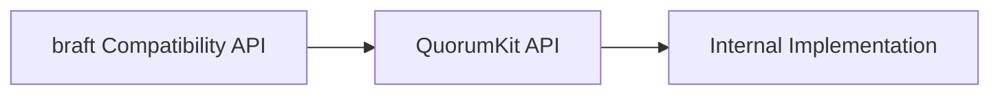

# Public API Overview

QuorumKit exposes two public API surfaces.

## Canonical Surface

The canonical surface lives under `include/quorumkit`.

```text
include/quorumkit/
  types.h
  node.h
  admin.h
  discovery.h
  storage.h
  util.h
  extensions/
    filesystem.h
    throttle.h
```

These headers define the vocabulary of the system.

## Compatibility Surface

The compatibility surface lives under `include/braft`.

```text
include/braft/
  configuration.h
  raft.h
  cli.h
  route_table.h
  storage.h
  util.h
  file_system_adaptor.h
  snapshot_throttle.h
  protobuf_file.h
```

These headers preserve source compatibility for existing braft integrations and route users into the QuorumKit implementation stack.

## Surface Relationship



The dependency direction is intentional. The canonical API defines the model. The compatibility API adapts to it.

## What The Canonical API Avoids

The canonical API does not expose:

- brpc transport objects,
- protobuf service base classes,
- IPv4-only endpoint types,
- storage backend implementation classes,
- build-tool-specific concepts.

This keeps the API stable even as transport, storage, runtime, and packaging integrations evolve.

## How To Read The API Docs

Read the canonical surface first. Then read the compatibility surface if you need braft-compatible source-level behavior.

- `docs/architecture/public-api.md`
- `docs/architecture/braft-compat.md`

The public headers are written as authoritative reference documents. The docs explain how the headers are organized and how the surfaces relate to one another.
