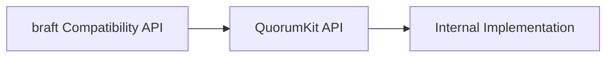

# Public API Overview

QuorumKit exposes two public faces.

The first is the one new code should use: `include/quorumkit`. It is the vocabulary the project wants to stand behind long term. The second is `include/braft`, a compatibility surface for code that already speaks in braft terms. Both are public. Only one is canonical.

## The QuorumKit Surface

The QuorumKit headers are organized by concept rather than by implementation history.

```text
include/quorumkit/
  types.h
  node.h
  admin.h
  discovery.h
  storage.h
  util.h
  extensions/
    filesystem.h
    throttle.h
```

Taken together, these headers describe the system the way a user thinks about it: identities, nodes, administration, discovery, persistence, and a small set of optional extensions.

## The braft Surface

The compatibility headers keep the old vocabulary available.

```text
include/braft/
  configuration.h
  raft.h
  cli.h
  route_table.h
  storage.h
  util.h
  file_system_adaptor.h
  snapshot_throttle.h
  protobuf_file.h
```

That surface exists so existing integrations can keep compiling while the repository moves toward a cleaner internal shape.

## How The Two Surfaces Relate



That direction matters. QuorumKit defines the model. The braft layer adapts to it. The project does not grow a second independent public model just because old names still exist.

## What QuorumKit Keeps Out Of The API

The QuorumKit API is deliberately narrower than the implementation beneath it. It does not expose brpc servers, protobuf service base classes, IPv4-only endpoint types, or backend-specific storage objects. Those are adapter concerns. The public API should survive transport changes, storage swaps, and build-system churn without forcing users to rewrite their application code.

## How To Use This Section

If you are writing new code, stay on the QuorumKit side and treat the braft pages as a reference for compatibility behavior.

- `docs/architecture/public-api.md`
- `docs/architecture/braft-compat.md`

Those pages go deeper on how the public boundary is shaped and what each surface is expected to carry.
