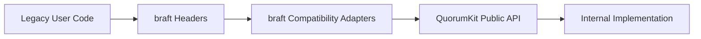

# braft Compatibility Surface

The `braft` surface is a supported compatibility API that preserves the original braft source-level programming model while delegating to QuorumKit.

## Purpose

The compatibility layer exists for users who already depend on braft headers, names, and calling patterns. It keeps migration cost low while making the canonical implementation architecture explicit.

The compatibility layer is public, but it is not the conceptual center of the system.

## Public Compatibility Headers

```text
include/braft/
  configuration.h
  raft.h
  cli.h
  route_table.h
  storage.h
  util.h
  file_system_adaptor.h
  snapshot_throttle.h
  protobuf_file.h
```

These headers are supported because existing braft users depend on them. They remain installed and documented.

## Compatibility Contract

The compatibility layer provides source compatibility, not ABI identity.

This means:

- existing code that includes braft headers continues to compile,
- existing code that calls braft-named APIs continues to build against the compatibility surface,
- internal object layout and binary compatibility are not the primary contract.

## Layering Model



The important property is directionality: braft depends on QuorumKit, not the other way around.

## Compatibility Responsibilities

The braft layer preserves:

- braft header names,
- braft namespaces,
- braft type names,
- braft helper functions,
- braft admin API names,
- braft route-table style discovery API names,
- braft storage construction patterns where required,
- compatibility with the existing braft storage backend family.

The braft layer does not own:

- the internal consensus engine,
- the runtime model,
- transport adapter implementations,
- storage backend implementations,
- new feature design.

## Compatibility Concepts That Stay Isolated

Some concepts belong to the compatibility surface because they carry inherited implementation choices.

Examples include:

- brpc-oriented service registration,
- endpoint parsing that assumes braft-style address formats,
- URI conventions that are inherited from the original system,
- protobuf-shaped CLI and file-service behavior when exposed in the compatibility surface.

These concepts remain available for compatibility, but they do not define the canonical QuorumKit model.

## Compatibility Code Size

The `src/braft_compat` directory stays intentionally thin.

The directory contains:

- type conversions,
- inline or trivial forwarding wrappers,
- argument normalization,
- compatibility-specific documentation,
- compatibility tests.

If consensus logic, log replication logic, or snapshot coordination logic starts to accumulate in the compatibility layer, the layering boundary has been violated.

## Compatibility Tests

The compatibility surface is validated by dedicated tests under `test/public/braft_compat`.

Those tests verify that:

- the braft names remain available,
- braft behavior matches QuorumKit behavior where the semantics are shared,
- braft-only compatibility features remain documented and bounded,
- compatibility code remains an adapter instead of becoming a second implementation.

## Migration Identity

The repository stays easy to read because the compatibility layer is named exactly for what it is. A reader can immediately distinguish:

- canonical surface: `include/quorumkit`
- compatibility surface: `include/braft`
- compatibility implementation: `src/braft_compat`
- implementation internals: `src/internal`
