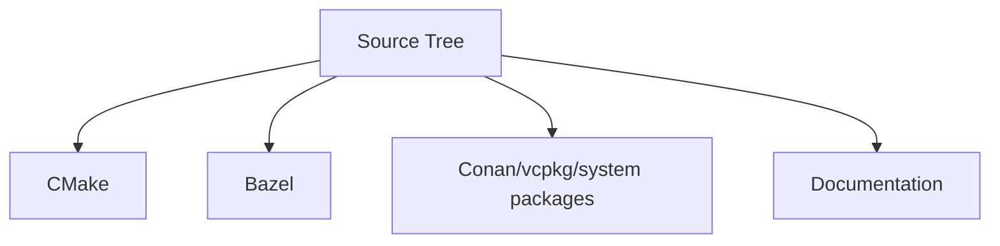

# Build and Packaging Modularity

The build layout keeps architecture independent from any single build tool or package manager.

## Build Tree Roles

```text
cmake/       canonical CMake modules, targets, install, export logic
bazel/       Bazel-only wrappers and BUILD glue
packaging/   package-manager metadata and integration helpers
```

## Core Principle

The source tree defines the architecture. Build systems consume that architecture. They do not define it.

This means:

- public include roots stay the same regardless of build tool,
- internal directories stay internal regardless of build tool,
- optional dependencies attach through modular target definitions,
- package-manager integrations reuse the same public layout.

## CMake Role

CMake provides the canonical build and install definitions.

It defines:

- library targets,
- include roots,
- install rules,
- export rules,
- feature toggles for optional adapters,
- test targets,
- packaging inputs.

## Bazel Role

Bazel is isolated under `bazel/` and Bazel-specific BUILD files.

Bazel glue:

- points at the canonical source layout,
- mirrors the public/internal target split,
- enables Bazel users to consume the library,
- stays out of the public API definition.

The repository does not encode architectural choices just to satisfy Bazel-specific conventions.

## Package Manager Role

The `packaging/` directory holds reusable metadata for external distribution systems such as:

- Conan,
- vcpkg,
- system packages,
- custom internal package registries.

Those integrations depend on the canonical include layout and exported targets rather than on tool-specific source rearrangements.

## Optional Dependency Modularity

Optional features are grouped by adapter and backend, not by build tool.

Examples include:

- brpc transport adapter,
- alternate transport adapters,
- local segment storage backend,
- RocksDB storage backend,
- SQLite storage backend,
- tracing and metrics adapters,
- OpenSSL-backed security adapters.

Each optional feature maps to a build module that can be enabled or disabled without changing public header placement.

## Artifact Identity

The build exports:

- canonical QuorumKit targets,
- compatibility braft targets where supported,
- public headers from `include/quorumkit` and `include/braft`,
- internal headers never exported.

## Build Independence Diagram



The same source and API layout drives every build and packaging path. This keeps the repository modular as external integration needs change.
