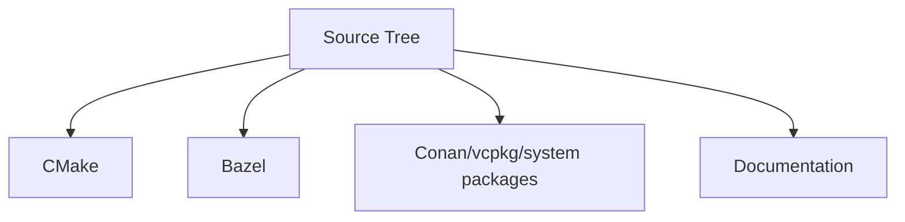

# Build and Packaging Modularity

Build tooling should follow the architecture, not define it.

That is the principle behind the layout here. The source tree decides what is public, what is internal, and where optional pieces plug in. CMake, Bazel, GitHub Pages, Conan, vcpkg, and any future packaging route should consume that structure rather than forcing the repository into tool-specific shapes.

## The Three Main Build Areas

```text
cmake/       canonical CMake modules, targets, install, export logic
bazel/       Bazel-only wrappers and BUILD glue
packaging/   package-manager metadata and integration helpers
```

`cmake/` is where the project defines the build and install story it considers primary. `bazel/` exists so Bazel users can consume the same source tree without turning Bazel conventions into architectural law. `packaging/` is where distribution-specific metadata belongs when Conan, vcpkg, or system packages enter the picture.

## Why This Separation Matters

If the build system starts deciding where headers live, what internal code looks like, or how optional features are expressed, the architecture gets brittle fast. Public include roots should stay public include roots no matter how the project is built. Internal directories should remain internal. Optional features should attach as modules, not leak into the core identity of the library.

## Optional Pieces Stay Modular

That applies equally to transport adapters, storage backends, tracing, security hooks, and packaging integrations. A RocksDB backend, an alternate transport, or an OpenSSL-backed adapter should be something you enable, not something that warps the rest of the tree around itself.

## The Payoff



When the source tree carries the architecture cleanly, every other integration path gets simpler. The docs stay consistent with the build. Packages export the same public headers. Alternate build systems stop behaving like alternate universes.
