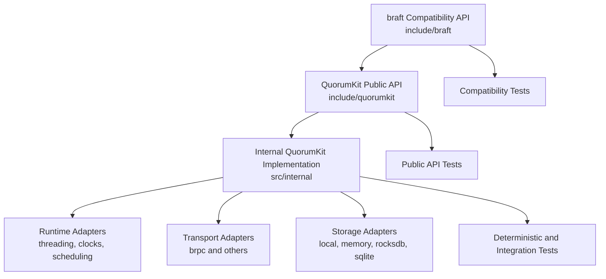

# QuorumKit Architecture

QuorumKit is a consensus and replicated state machine library with two public API surfaces and one internal implementation surface.

- `quorumkit` is the canonical public API.
- `braft` is the compatibility public API.
- `internal` contains the implementation, runtime adapters, protocol adapters, and test-only infrastructure.

The architecture is organized around one rule: public interfaces are easy to find, easy to document, and easy to test in isolation, while internal code is free to evolve without changing the user-facing contract.

## Layer Summary



## Repository Contract

The repository presents a strict boundary between public and internal code.

```text
include/
  quorumkit/      canonical public API
  braft/          compatibility public API

src/
  quorumkit/      public API implementations and thin facades
  braft_compat/   compatibility adapters only
  internal/       core state machine, runtime, transport, storage, snapshotting

test/
  public/         public API contract tests
  internal/       internal subsystem tests
  simulation/     deterministic cluster and fault tests

bazel/            Bazel-only build glue
cmake/            CMake modules and install/export logic
packaging/        package-manager integration and distribution metadata
```

Only headers under `include/quorumkit` and `include/braft` are installed and documented as supported interfaces. Everything else is implementation detail.

## Design Principles

### Canonical API First

QuorumKit defines the primary vocabulary of the system. New code, new examples, and new documentation use `quorumkit` names and headers first.

### Compatibility Is Explicit

The `braft` surface is a named compatibility layer, not the implementation home of the system. This keeps compatibility visible in the directory tree and keeps the scope of compatibility work bounded.

### Transport Neutrality

The consensus engine does not depend on brpc, protobuf service base classes, IPv4-only endpoint types, or a particular RPC framework. Transport-specific code lives in adapters.

### Storage Neutrality

The core depends on abstract storage contracts, not on a specific log backend, metadata store, or snapshot representation. Backend selection is an adapter concern.

### Deterministic Testability

The architecture separates the core state machine from clocks, randomness, scheduling, threads, transport, and storage side effects. This makes the public API testable and makes the core suitable for deterministic simulation and formal reasoning.

### Headers As Documentation

Public headers are authoritative references. A user can read the header for a type or function and understand purpose, lifecycle, ownership, threading, error behavior, and invariants without needing an external guide.

## Architecture Map

- [Repository Layout](./module-layout.md)
- [Canonical QuorumKit Public API](./public-api.md)
- [braft Compatibility Surface](./braft-compat.md)
- [Internal Architecture](./internal-architecture.md)
- [Runtime and Execution Model](./runtime.md)
- [Transport Layer](./transport.md)
- [Storage Layer](./storage.md)
- [Testing Architecture](./testing.md)
- [Build and Packaging Modularity](./build-and-packaging.md)
- [Protocols and Features](./protocols-and-features.md)
- [Compatibility and Migration](./migrations.md)

## System Identity

QuorumKit is a library with a narrow, documented API surface and a broad internal refactoring envelope. That identity is reflected in the source tree, the test tree, the build tree, and the documentation tree.
