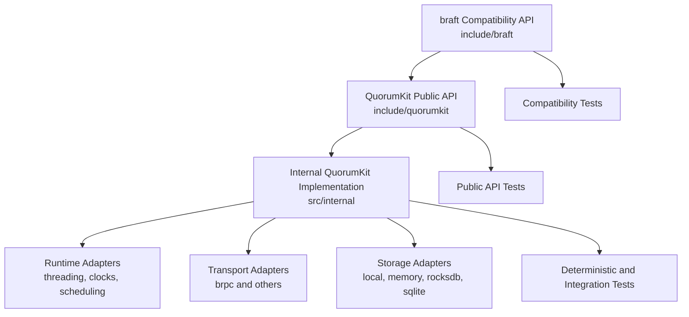

# QuorumKit Architecture

QuorumKit has two public APIs and one implementation beneath them.

- `quorumkit` is the API the project is built around.
- `braft` remains as a compatibility layer.
- `internal` is where the engine, adapters, and test infrastructure live.

That sounds simple, but it changes the shape of the repository in an important way. Public code becomes easy to spot. Compatibility becomes explicit. Internal code gets room to change aggressively without dragging users through every refactor.

## The Shape Of The System



The key idea is that the public surface stays small while the implementation grows inward, not outward.

## Repository Contract

The directory layout is part of the architecture, not just housekeeping.

```text
include/
  quorumkit/      canonical public API
  braft/          compatibility public API

src/
  quorumkit/      public API implementations and thin facades
  braft_compat/   compatibility adapters only
  internal/       core state machine, runtime, transport, storage, snapshotting

test/
  public/         public API contract tests
  internal/       internal subsystem tests
  simulation/     deterministic cluster and fault tests

bazel/            Bazel-only build glue
cmake/            CMake modules and install/export logic
packaging/        package-manager integration and distribution metadata
```

Only `include/quorumkit` and `include/braft` are installed as supported headers. Everything else is fair game for refactoring.

## What This Architecture Optimizes For

The project is trying to make a few things true at the same time.

First, new code should read like QuorumKit, not like a historical fork. Second, compatibility should be honest about what it is: a bridge, not a second center of gravity. Third, the consensus core should stay small enough to reason about clearly, while the surrounding system remains modular enough to swap transports, storage engines, runtimes, and packaging strategies without rewriting the heart of the library.

The testing story follows the same logic. Public behavior should be easy to test directly. The core should be able to run under deterministic clocks, transports, and storage fakes. The whole system should be open to simulation rather than only end-to-end smoke tests.

## Read The Details

- [Repository Layout](./module-layout.md)
- [Canonical QuorumKit Public API](./public-api.md)
- [braft Compatibility Surface](./braft-compat.md)
- [Internal Architecture](./internal-architecture.md)
- [Runtime and Execution Model](./runtime.md)
- [Transport Layer](./transport.md)
- [Storage Layer](./storage.md)
- [Testing Architecture](./testing.md)
- [Build and Packaging Modularity](./build-and-packaging.md)
- [Protocols and Features](./protocols-and-features.md)
- [Compatibility and Migration](./migrations.md)

If you keep only one idea from this section, it should be this: QuorumKit draws a hard line between what users depend on and what the project is free to change.
