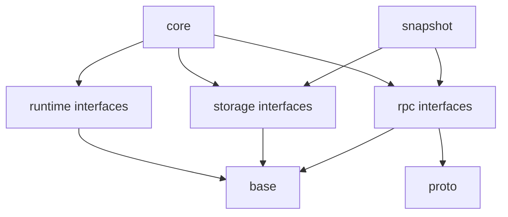

# Internal Architecture

Everything under `src/internal` exists to support the public surfaces without becoming one.

That distinction matters. Once code is clearly internal, the project can split modules, replace implementations, or move pieces around without turning every refactor into a breaking API debate.

## The Main Internal Areas

```text
src/internal/
  core/
  runtime/
  rpc/
  storage/
  snapshot/
  proto/
  base/
```

The names are plain on purpose. They answer the question “where does this kind of code belong?” without making a reader memorize a private taxonomy first.

## What Lives Where

`core/` holds the deterministic heart of the system: elections, replication state, membership transitions, and the sequencing rules that make the replicated state machine behave correctly. This is the part that should remain as small and direct as possible. It should not know about sockets, RPC servers, filesystem APIs, or ad hoc timing tricks.

`runtime/` is the layer around that core. It provides clocks, timers, schedulers, random sources, and the adapters that connect the single-threaded model of the core to real execution environments. It is where production threading and deterministic simulation meet.

`rpc/` owns message transport. That includes transport-neutral interfaces and concrete adapters such as brpc. The important rule is that transport points inward toward the core; the core does not inherit transport assumptions.

`storage/` owns persistence contracts and the code that satisfies them. Log storage, metadata storage, snapshots, backend registries, in-memory fakes, and concrete backends all belong here.

`snapshot/` handles the workflow around snapshots: producing them, installing them, moving them around, and coordinating with the rest of the system.

`proto/` is where wire formats live. It is useful to keep serialization logic close together and separate from the public domain model.

`base/` is the internal toolbox: helpers and small abstractions that are useful inside the implementation but do not belong in installed headers.

## Dependency Direction



The core depends on interfaces. Adapters depend on the core. That direction is what keeps the engine from getting tangled up with whichever transport, clock, or backend happens to be in use today.

## Why This Makes Refactoring Safer

QuorumKit wants room to change its internals aggressively: a cleaner runtime model, transport swaps, storage migrations, maybe a much smaller provable core over time. That is only realistic if the code that changes most is clearly on the inside.

The internal layout is there to create that freedom.
