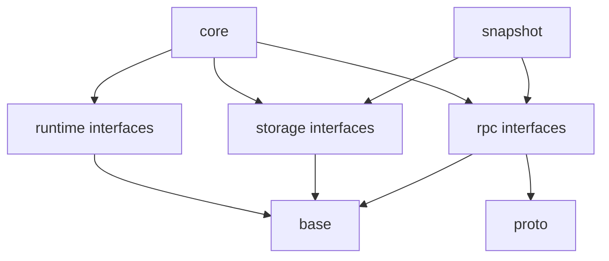

# Internal Architecture

The internal architecture holds the parts of the system that are free to evolve without changing the public contract.

## Internal Subsystems

```text
src/internal/
  core/
  runtime/
  rpc/
  storage/
  snapshot/
  proto/
  base/
```

## Subsystem Roles

### `core`

`core` contains the deterministic state machine of the consensus engine. It is the part of the system that defines the ordering, safety, and transition rules of replication.

This subsystem contains:

- node state transitions,
- election logic,
- replication state updates,
- membership transition logic,
- lease and witness state transitions when those are part of the enabled feature set,
- core command application sequencing.

The core does not own threads, sockets, RPC servers, filesystem APIs, or external timing sources.

### `runtime`

`runtime` contains execution adapters around the deterministic core.

This subsystem contains:

- clocks,
- timers,
- scheduler interfaces,
- asynchronous work submission,
- randomness sources,
- production thread adapters,
- deterministic single-threaded runtimes for tests and simulation.

### `rpc`

`rpc` contains transport-neutral messaging contracts and concrete transport adapters.

This subsystem contains:

- message dispatch interfaces,
- request/response transport abstractions,
- server registration adapters,
- brpc-based transport adapters,
- client-side connection factories,
- transport-neutral address representation and resolution helpers.

### `storage`

`storage` contains backend-neutral storage contracts plus backend adapters.

This subsystem contains:

- log persistence adapters,
- metadata persistence adapters,
- snapshot persistence adapters,
- backend registries,
- backend capability checks,
- in-memory test backends,
- production backends such as local segment log and external databases.

### `snapshot`

`snapshot` contains snapshot coordination that is separate from the persistent storage contract itself.

This subsystem contains:

- snapshot production orchestration,
- snapshot installation,
- snapshot transfer coordination,
- deduplication and throttling hooks,
- snapshot import and export flows.

### `proto`

`proto` contains wire-format definitions and translation logic. It does not define the public domain model.

This separation allows the system to keep domain types stable while serialization choices evolve.

### `base`

`base` contains internal helpers, small abstractions, and shared implementation-only utilities. Nothing in this directory appears in installed headers.

## Dependency Discipline



The deterministic core depends on abstract services, not concrete adapters. Concrete adapters point inward toward the core.

## Refactoring Envelope

Because internal code is not public by placement, internal subsystem boundaries are allowed to change as long as the public QuorumKit and braft contracts stay stable.

This is the mechanism that makes aggressive refactoring safe.
