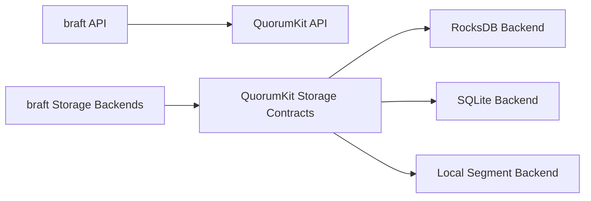

# Compatibility And Migration

Compatibility is only useful if it gives people a path forward.

In QuorumKit, that path runs along two tracks. One is API compatibility through the braft surface. The other is storage compatibility through support for existing braft storage backends and migration into newer backend arrangements.

The important part is that migration is treated as a supported part of the design, not as a secret internal ritual. A team should not need to reverse-engineer the repository to move from an old API surface to the new one, or from an inherited storage layout to a new backend.

In practice, that means migration tools and migration-aware backends need to validate the things that actually matter: index continuity, term continuity, metadata integrity, snapshot boundaries, replay correctness, and readability on the target side.

If compatibility keeps systems stuck forever, it is not really compatibility. It is dead weight. The goal here is compatibility with motion.
