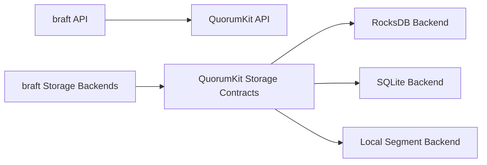

# Compatibility And Migration

Compatibility and migration are repository-level concerns, not scattered exceptions.

## Compatibility Scope

The repository preserves compatibility along two dimensions:

- API compatibility through the `braft` surface,
- storage compatibility through support for existing braft storage backends and storage layout assumptions.

## Migration Scope

The repository treats migration as a supported movement between well-defined surfaces.

This includes:

- migration from braft public APIs to QuorumKit public APIs,
- migration from braft storage backends to QuorumKit-managed backends,
- migration between multiple storage backend families,
- migration of examples, tools, and tests from the compatibility surface to the canonical surface.

## Architectural Rule

Migration paths are explicit and documented. The repository does not rely on users discovering internal layouts and constructing one-off conversion flows on their own.

## Migration Diagram

## Validation Expectations

Migration tooling and migration-aware backend behavior validate:

- index continuity,
- term continuity,
- metadata integrity,
- snapshot boundary correctness,
- replay correctness,
- post-migration readability by the target backend.

This makes migration part of the supported system model instead of an operational afterthought.
