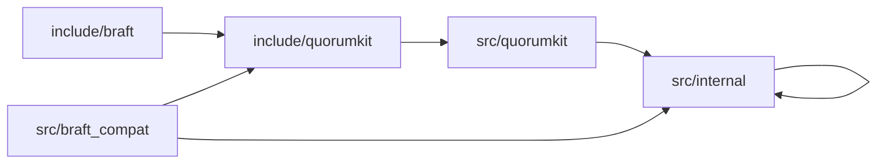

# Repository Layout

The repository layout makes public code, compatibility code, and internal code visually distinct.

## Top-Level Structure

```text
include/
  quorumkit/
  braft/

src/
  quorumkit/
  braft_compat/
  internal/

test/
  public/
    quorumkit/
    braft_compat/
  internal/
  simulation/

examples/
  quorumkit/
  braft_compat/

tools/
  quorumkit/
  braft/

cmake/
bazel/
packaging/
docs/
```

## Directory Roles

### `include/quorumkit`

This directory contains the canonical QuorumKit public API. Every header in this directory is:

- installed for consumers,
- versioned as part of the library contract,
- documented as supported,
- tested by public API contract tests.

### `include/braft`

This directory contains the supported compatibility API for braft users. The directory is public, but it is explicitly compatibility-oriented in role. It exists to preserve source compatibility while routing users into QuorumKit internals through a well-defined adapter layer.

### `src/quorumkit`

This directory contains implementation files for the canonical public API. It may contain thin facades, argument normalization, translation into internal types, and stable public-layer helpers. It does not contain the consensus engine itself.

### `src/braft_compat`

This directory contains compatibility-only implementation code. Files in this directory translate braft surface types, names, and invocation patterns into the canonical QuorumKit model.

The directory is intentionally small. If large amounts of logic accumulate here, the compatibility layer is leaking implementation concerns.

### `src/internal`

This directory contains code that is not installed and not documented as public contract. It contains the engine and all implementation-specific adapters.

```text
src/internal/
  core/       deterministic consensus core and state transitions
  runtime/    scheduling, timers, clocks, random sources, threading adapters
  rpc/        transport-neutral RPC contracts and concrete adapters
  storage/    storage contracts, registries, and backend adapters
  snapshot/   snapshot persistence and snapshot transfer logic
  proto/      wire formats and serialization adapters
  base/       internal helpers that never appear in public headers
```

## Dependency Rules



The reverse edges are forbidden.

- `src/internal` does not include from `include/braft`.
- `include/quorumkit` does not include from `src/internal`.
- `include/quorumkit` does not mention build-specific or transport-specific implementation types.
- `include/braft` does not define the system model. It adapts to the model defined by QuorumKit.

## Installation Rules

Only `include/quorumkit/**` and `include/braft/**` are installed. Headers under `src/**` are never installed.

This rule matters because the current braft-style layout exposes too many implementation headers to users. The new layout makes the supported contract obvious by inspection.

## Naming Rules

### Public Headers

Public headers use concept-driven names.

- `include/quorumkit/types.h`
- `include/quorumkit/node.h`
- `include/quorumkit/admin.h`
- `include/quorumkit/discovery.h`
- `include/quorumkit/storage.h`
- `include/quorumkit/util.h`
- `include/quorumkit/extensions/filesystem.h`
- `include/quorumkit/extensions/throttle.h`

Compatibility headers preserve braft names.

- `include/braft/raft.h`
- `include/braft/configuration.h`
- `include/braft/cli.h`
- `include/braft/route_table.h`
- `include/braft/storage.h`

### Internal Files

Internal files are free to use implementation-oriented names because they are not part of the installed surface.

## Documentation Rules

Each public directory contains a small number of high-value headers. This makes the API easy to browse and keeps the directory tree self-describing.

Public readers do not need to guess whether `node_manager.h`, `replicator.h`, `closure_queue.h`, or `raft_service.h` are safe to depend on. Those files are internal by placement alone.
