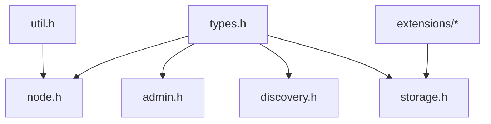

# Canonical Public API

The canonical public surface of QuorumKit lives under `include/quorumkit`. It defines the vocabulary that users of the library depend on.

## Public Header Set

```text
include/quorumkit/
  types.h
  node.h
  admin.h
  discovery.h
  storage.h
  util.h
  extensions/
    filesystem.h
    throttle.h
```

Each header groups concepts by role rather than by inherited implementation file layout.

## Header Responsibilities

### `types.h`

`types.h` defines the stable domain model of the system.

This includes:

- group identifiers,
- node identifiers,
- peer identifiers,
- membership configuration,
- roles such as replica and witness,
- status and error types used across the public surface,
- small value types shared by multiple APIs.

This header does not define transport-specific endpoint classes or RPC-specific controller types.

### `node.h`

`node.h` defines the replicated state machine host.

This includes:

- node lifecycle,
- state machine callbacks,
- apply semantics,
- leadership queries,
- membership mutation entry points,
- snapshot trigger entry points,
- node configuration objects,
- bootstrap and garbage-collection entry points when they are part of the stable surface.

This header explains ordering guarantees, ownership rules for applied tasks, and the threading model visible to user callbacks.

### `admin.h`

`admin.h` defines cluster administration operations that target groups and peers from outside the normal apply path.

This includes:

- add peer,
- remove peer,
- change peers,
- reset peer,
- transfer leader,
- snapshot trigger.

### `discovery.h`

`discovery.h` defines leader discovery and route-table style functions. It describes how a client finds the current leader, caches it, invalidates it, and refreshes it.

### `storage.h`

`storage.h` defines the contracts for the persistent state of the system.

This includes:

- log storage,
- metadata storage,
- snapshot storage,
- backend capability descriptions,
- backend registration and construction APIs,
- backend-neutral configuration and injection points.

### `util.h`

`util.h` contains only helpers that are truly public concepts. It does not become a dumping ground for internal utilities.

If a helper exists only because the implementation needs it, it belongs under `src/internal/base` instead.

### `extensions/*`

`extensions/filesystem.h` and `extensions/throttle.h` contain advanced extension points that are part of the supported public contract but are not required for basic use.

## Public API Constraints

The canonical public API does not expose the following implementation dependencies:

- `brpc::Server`
- `brpc::Channel`
- `brpc::Controller`
- protobuf service base classes
- `butil::EndPoint`
- `bthread` types
- `gflags` flags
- `glog` logging macros as part of the API contract
- storage backend implementation classes

This rule keeps QuorumKit stable even when the runtime, transport, storage, and build integrations change.

## Documentation Standard For Headers

Every public header is readable as a reference document.

Each public header contains:

- a file-level overview,
- the role of the header in the API,
- a glossary for terms that are specific to the header,
- a stability note when relevant,
- cross references to related public headers.

Each public type or function documents:

- purpose,
- inputs and outputs,
- ownership and lifetime,
- blocking behavior,
- concurrency behavior,
- error behavior,
- invariants,
- preconditions,
- postconditions,
- minimal usage examples when the contract is subtle.

## Public API Dependency Model



`types.h` sits at the bottom of the public vocabulary. Other public headers depend on those shared types, but not on internal implementation headers.

## Public API Testability

The public surface is designed for direct unit testing.

This means:

- construction does not require a real RPC server unless the caller explicitly asks for a networked adapter,
- time and randomness are injectable through configuration,
- storage can be supplied as in-memory fakes,
- transport can be replaced by an in-memory adapter,
- public API tests do not reach through private members or compile with visibility hacks.

The shape of the public API makes its own contract testable.
