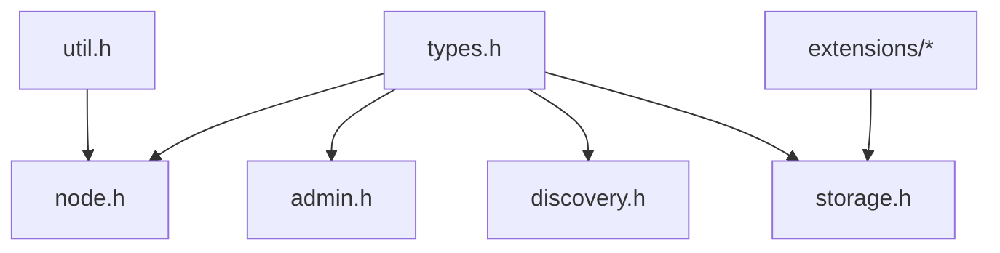

# Canonical Public API

The QuorumKit API lives under `include/quorumkit`. That is the surface new applications should learn, document against, and build on.

The point of this layout is not just cosmetic. It gives the library a vocabulary that matches the problem domain instead of mirroring whatever happened to exist in the implementation years ago.

## The Header Set

```text
include/quorumkit/
  types.h
  node.h
  admin.h
  discovery.h
  storage.h
  util.h
  extensions/
    filesystem.h
    throttle.h
```

Each header has a clear job.

- `types.h` is the shared vocabulary: identities, configurations, roles, and status objects.
- `node.h` is the heart of the public surface. It covers node lifecycle, apply behavior, leadership, membership changes, and the user-facing state machine contract.
- `admin.h` is for operational control: add a peer, remove one, transfer leadership, trigger snapshots, and related cluster actions.
- `discovery.h` handles leader lookup and route-table style client behavior.
- `storage.h` describes persistence as a set of contracts rather than a pile of backend classes.
- `util.h` stays small. If something only helps the implementation, it belongs under `src/internal/base`, not in the public API.
- `extensions/*` holds optional hooks such as custom filesystems and throttling.

## What Makes This API Different

The QuorumKit API is trying to be stable in the right places and quiet in the wrong ones.

It talks about nodes, groups, storage, and administration. It does not drag transport classes, thread-library types, protobuf service bases, or logging frameworks into every signature. A user should be able to understand the public model of the system without reverse-engineering brpc, bthread, or a specific storage plugin.

## What The Headers Need To Explain

Public headers are not just declarations. They are the primary reference for the library.

That means a good header tells you:

- what problem a type or function exists to solve,
- what the caller owns and what the library owns,
- what may block and what will not,
- what thread or callback context is in play,
- what errors mean,
- what invariants the caller has to respect.

If someone has to go spelunking through `src/internal` just to understand how to call a public function safely, the header has not done its job.

## Dependency Shape



`types.h` sits near the bottom because it holds the shared nouns of the API. The rest of the surface builds on those nouns instead of inventing overlapping mini-models.

## Designed To Be Testable

The API is also shaped so that it can be tested directly. Creating a node should not require a live RPC server unless the caller chooses a real network adapter. Time and randomness should be injectable. Storage should be replaceable with in-memory fakes. Public API tests should stay on the public side of the boundary instead of cheating with private-member hacks.

That is not just test hygiene. It is one of the main reasons the API stays readable. When dependencies are explicit, the public model gets clearer.
