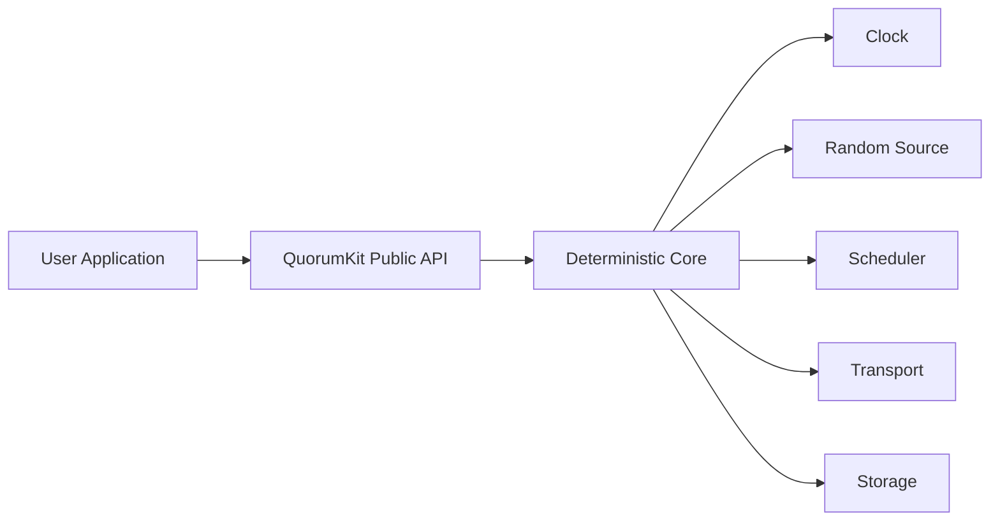

# Runtime and Execution Model

QuorumKit separates the deterministic consensus core from the runtime that executes it.

## Core Principle

The core is a state transition system. The runtime supplies time, scheduling, randomness, delivery, and persistence side effects.

This split keeps the core suitable for:

- direct unit testing,
- deterministic simulation,
- fault injection,
- model checking,
- formal reasoning,
- production execution on threaded runtimes.

## Runtime Components

## Clock

The runtime exposes time as an injected dependency.

The core uses time to evaluate:

- election timeouts,
- lease validity,
- retry backoff,
- snapshot cadence,
- testing deadlines and determinism hooks.

The clock interface supports both real wall-clock execution and deterministic test clocks.

## Scheduler

The scheduler is responsible for sequencing work that occurs outside the pure state transition itself.

The runtime model defines:

- how work is queued,
- where callbacks run,
- whether callbacks run inline or asynchronously,
- whether execution is single-threaded or multi-threaded,
- whether ordering is deterministic or best-effort production scheduling.

The public API documents which callbacks are serialized, which are user-owned, and which runtime guarantees hold regardless of scheduler implementation.

## Randomness

Election jitter and any other randomized behavior are not sourced directly from process-global random helpers. The runtime supplies randomness so tests can reproduce behavior exactly.

## Single-Threaded Core

The architecture treats the core as logically single-threaded, even when the production runtime uses concurrency around it.

This means:

- state transitions are expressed as ordered events,
- the core does not rely on races for correctness,
- concurrency lives in adapters and queues around the core,
- deterministic replay remains possible.

## User Callback Semantics

The runtime defines where user callbacks execute, but the public API defines what users can rely on.

That contract covers:

- callback sequencing,
- shutdown ordering,
- completion ownership,
- whether callbacks may block,
- whether callbacks may re-enter the API.

## Runtime Adapters

The runtime layer contains concrete adapters for:

- production threading and timer facilities,
- test schedulers,
- deterministic simulation runtimes,
- any future single-threaded proof-oriented host environment.

The runtime layer is modular because the consensus model itself does not depend on one execution technology.
