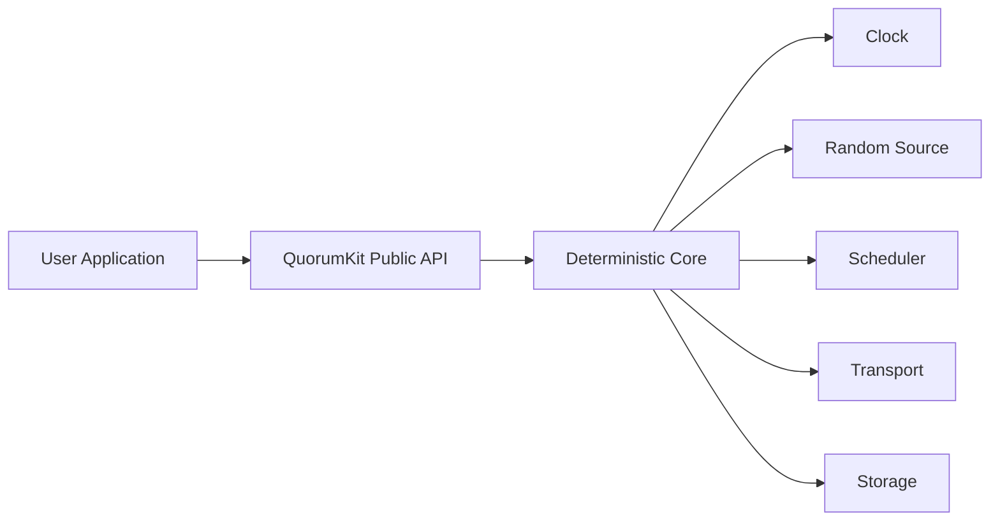

# Runtime and Execution Model

QuorumKit treats the core of the system as a state machine and the runtime as everything needed to let that state machine live in the world.

That split is one of the most important design choices in the repository. It is what makes the core easier to understand, easier to test, and eventually easier to reason about formally.

## The Basic Picture

The core should not decide what time it is, how work gets scheduled, how packets move, or how bytes reach disk. It asks for those services through interfaces.

## Time, Scheduling, And Randomness

Time drives elections, leases, retries, and test deadlines. Scheduling decides where work runs and in what order callbacks appear. Randomness provides election jitter and any other controlled non-determinism.

Those concerns are deliberately injected rather than pulled from global helpers. That makes behavior reproducible in tests and keeps the core from quietly depending on whatever runtime happens to be linked in.

## Why The Core Stays Logically Single-Threaded

The core is allowed to live inside a concurrent production system, but it should not rely on concurrency for correctness. The clean mental model is an ordered stream of events and state transitions. Threads, queues, timers, and asynchronous dispatch belong outside that model.

This pays off in three places at once:

- unit tests can run with deterministic clocks and schedulers,
- simulation can replay behavior precisely,
- the core remains small enough to reason about without juggling races in your head.

## Callback Semantics Matter

The runtime is also where callback behavior becomes concrete. Users need to know whether callbacks are serialized, whether they may block, whether they can re-enter the API, and what happens during shutdown. Those guarantees belong in the public contract even when the mechanism that enforces them lives in the runtime layer.

## Adapters, Not Assumptions

Production threading, deterministic test schedulers, single-threaded simulation loops, and future proof-oriented hosts should all fit under the same broad runtime contract. If a runtime choice changes the meaning of the consensus model, the boundary is in the wrong place.
