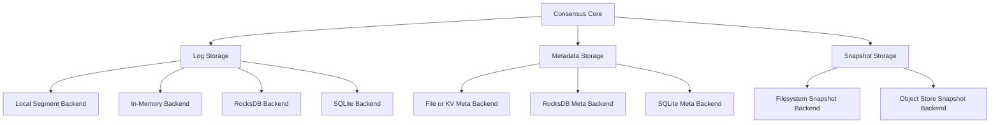

# Storage Layer

QuorumKit treats storage as a set of backend-neutral contracts with backend-specific adapters.

Storage compatibility is a first-class requirement. The repository supports the existing braft storage backend family and treats migration between backends as part of the supported storage story.

## Storage Roles

The architecture separates persistent state into three public contracts:

- log storage,
- metadata storage,
- snapshot storage.

Each contract has its own lifecycle, invariants, capability set, and test suite.

## Storage Model

## Public Storage Contracts

### Log Storage

Log storage defines the ordered replicated log.

The public contract defines:

- index ordering,
- append semantics,
- read semantics,
- truncation semantics,
- reset semantics after snapshot install,
- crash consistency expectations,
- ownership rules for returned entries.

### Metadata Storage

Metadata storage defines durable node metadata such as term, vote, and versioned group metadata.

The public contract defines:

- durability expectations,
- atomicity expectations,
- group scoping,
- garbage-collection semantics.

### Snapshot Storage

Snapshot storage defines persisted snapshots and snapshot copy orchestration hooks.

The public contract defines:

- snapshot writer lifecycle,
- snapshot reader lifecycle,
- metadata save and load behavior,
- copy-from semantics,
- optional extension points such as throttling and custom filesystems.

## Backend Modularity

Storage backends are adapters selected by configuration or explicit dependency injection.

The architecture supports:

- the existing braft storage backends,
- local segment-based logs,
- in-memory test backends,
- RocksDB-backed logs and metadata,
- SQLite-backed logs and metadata,
- alternative snapshot stores.

The core does not need to change when a new backend is introduced.

## Compatibility With Existing braft Storage

QuorumKit maintains compatibility with the existing braft storage model so that an existing deployment does not need to discard persisted state to adopt the canonical API surface.

This compatibility covers:

- existing log storage implementations,
- existing raft metadata storage implementations,
- existing snapshot storage implementations,
- existing URI-style backend selection patterns where deployed systems still depend on them.

The compatibility layer preserves the original construction path, while the canonical QuorumKit storage model presents the same storage family through a cleaner, backend-neutral contract.

## Configuration Model

The canonical QuorumKit API supports two ways to supply storage:

- direct injection of storage objects,
- backend selection through a registry and backend-specific configuration.

URI-based configuration remains available as a compatibility-oriented construction pattern, but it is not the only expression of the storage model.

## Backend Migration

Backend migration is part of the storage architecture.

The storage layer defines migration as a supported operation between backend implementations rather than as an ad hoc external script with repository-specific assumptions.

The migration model covers:

- migration from the existing braft storage backends into QuorumKit-managed backends,
- migration between backend families such as local segment storage, RocksDB, and SQLite,
- migration across log, metadata, and snapshot components in a coordinated way,
- verification that migrated state preserves the durable replicated history required by the core.

The exact mechanism may differ by backend pair, but the storage architecture treats migration as part of backend capability and backend tooling.

Common migration paths include:

- snapshot export and import,
- log replay into a new backend,
- metadata translation,
- offline copy with validation,
- backend-aware tooling that checks index, term, and snapshot boundaries.

This keeps backend modularity practical for real systems instead of purely theoretical.

## Capability Model

Not every backend needs to support every optional feature.

The architecture distinguishes:

- required capabilities,
- optional capabilities,
- backend-specific tuning options.

Examples of optional capabilities include:

- garbage collection,
- multi-node shared storage,
- snapshot deduplication,
- custom filesystem integration,
- import/export helpers,
- migration helpers,
- compaction hints.

## Storage Testability

Every storage contract has backend-neutral contract tests.

The same behavioral suite runs against:

- the existing braft-compatible backends,
- memory backends,
- local production backends,
- database backends,
- any new backend added later.

This keeps backend substitution honest and makes regressions visible at the contract level instead of only through end-to-end tests.

## Storage And The Core

The deterministic core interacts with abstract storage behavior. Backend registration mechanisms and concrete database integration stay outside the core.

This is what makes storage swappable without rewriting consensus logic.
