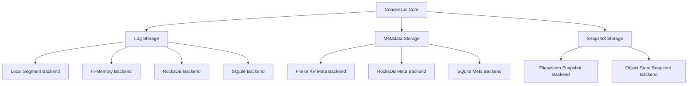

# Storage Layer

Storage is one of the places where QuorumKit has to be both ambitious and practical.

The library wants a clean storage model: backend-neutral contracts, swappable implementations, deterministic fakes for tests, and enough separation from the core that changing persistence does not mean rewriting consensus logic. At the same time, it has to respect the world it comes from. Existing braft storage backends matter, and migration between backends matters just as much.

## Three Kinds Of Persistent State

The public model separates persistence into three contracts.

- log storage holds the replicated log,
- metadata storage holds durable node metadata such as term and vote,
- snapshot storage holds materialized snapshots and the machinery around them.

That split is not arbitrary. These parts of the system have different lifecycles, different performance profiles, and different migration stories.

## What The Contracts Need To Say Clearly

Good storage interfaces are not just method lists. They have to pin down behavior.

For the log, that means append order, truncation, reset after snapshot installation, crash consistency, and ownership of returned entries. For metadata, it means durability and atomicity. For snapshots, it means reader and writer lifecycles, metadata rules, and how copy or import operations behave.

If those contracts are fuzzy, backend modularity turns into wishful thinking.

## Compatibility With Existing braft Storage

QuorumKit is not trying to pretend old deployments never happened. The existing braft storage family remains part of the supported story. A team should be able to adopt the QuorumKit API without throwing away persisted state simply because the public vocabulary has improved.

That includes the familiar log, raft metadata, and snapshot implementations, along with the URI-style construction paths that older systems may still rely on.

The compatibility layer keeps those entry points alive. The canonical QuorumKit API presents the same storage world more cleanly.

## Backend Modularity In Practice

Once the contracts are clear, the backend story gets much better. The core can talk to in-memory stores in tests, local segment stores in production, and other engines such as RocksDB or SQLite when they make sense for a deployment.

Different backends will naturally support different capabilities. That is fine. The important part is to make those differences explicit instead of burying them in undocumented behavior.

Some features are required. Others are optional: garbage collection, snapshot deduplication, custom filesystem hooks, import/export helpers, migration helpers, compaction hints, and similar extensions.

## Migration Is Part Of The Design

Backend migration is not an afterthought here. It is part of the storage story.

Moving from an existing braft backend to a new QuorumKit-managed backend should be treated as a supported operation with validation, not as an improvised one-off script. The same applies when moving between backend families.

In practice that can mean log replay, metadata translation, snapshot import/export, offline validation, or backend-aware migration tools. The exact mechanism will vary, but the architectural expectation is stable: migration preserves the durable replicated history that the core depends on.

## Why This Matters For Testing

Storage modularity is not only about production flexibility. It is also what lets the same contract tests run against in-memory backends, local production backends, and future database-backed implementations. When the same suite passes everywhere, backend substitution becomes credible instead of aspirational.

The core should only know that storage obeys the contract. Everything else belongs outside it.
