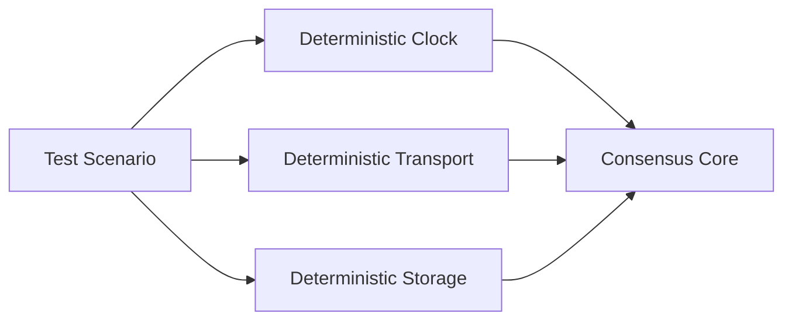

# Testing Architecture

QuorumKit is designed so that its testing story follows the architecture instead of fighting it.

That sounds obvious, but many systems end up with the opposite: public APIs that are awkward to test, internals that can only be exercised end to end, and simulation that never really matches production assumptions. This repository is trying to avoid that trap.

## The Test Tree

```text
test/
  public/
    quorumkit/
    braft_compat/
  internal/
    core/
    runtime/
    transport/
    storage/
    snapshot/
  simulation/
    cluster/
    fault/
    workload/
```

You can read this tree almost as a promise.

Public behavior gets tested through public APIs. Internal mechanisms get tested in smaller pieces. Cluster behavior gets tested under a deterministic simulation environment.

## Public API Tests

`test/public/quorumkit` is where the canonical API proves it can stand on its own. If a user can create a node, apply commands, drive discovery, or use the storage interfaces according to the headers, that behavior should be testable here without cheating.

`test/public/braft_compat` serves a different purpose. It makes sure the compatibility layer stays compatible and stays thin. Old names should still work, but the compatibility layer should not quietly become a second implementation.

## Internal Tests

`test/internal` is where the smaller moving parts get exercised directly: the deterministic core, runtime mechanics, transport adapters, storage implementations, and snapshot workflows. These tests should be fast, focused, and good at catching regressions before they spread outward.

## Simulation

The simulation layer is where the system gets stressed the way distributed systems actually fail: partitions, loss, delay, restart, storage problems, leadership churn, membership changes, witness behavior, and ugly workloads.



This is the beginning of the FoundationDB-style story around QuorumKit: not just unit tests, but a programmable environment where whole clusters can be driven reproducibly.

## What The Design Avoids

The public API should not require tricks to test. No `private`-to-`public` macros, no dependency on internal headers just to write a basic API test, no requirement that every unit test boot a live network stack, and no hidden global time source shaping behavior behind the scenes.

Those constraints are useful even outside testing. They keep the design honest.

## Why The Test Structure Matters

The test layout is also a form of documentation. A reader should be able to tell which behavior is part of the public contract, which behavior is an implementation detail, and where the project expects determinism to come from.
