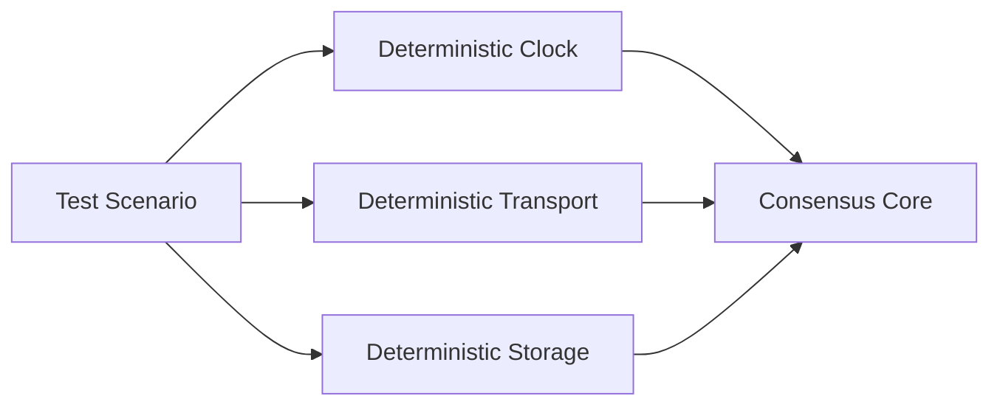

# Testing Architecture

QuorumKit is organized so that testing mirrors the architectural boundaries of the code.

## Test Tree

```text
test/
  public/
    quorumkit/
    braft_compat/
  internal/
    core/
    runtime/
    transport/
    storage/
    snapshot/
  simulation/
    cluster/
    fault/
    workload/
```

## Test Layers

### Public QuorumKit Tests

`test/public/quorumkit` verifies the canonical API contract.

These tests answer questions such as:

- Can a user construct and drive a node with documented dependencies?
- Do apply semantics, callback semantics, and error behavior match the public headers?
- Can the API run with in-memory transport and in-memory storage?
- Do admin and discovery APIs behave according to contract?

### Public braft Compatibility Tests

`test/public/braft_compat` verifies that the compatibility layer preserves the supported braft-compatible behavior.

These tests confirm that:

- the compatibility headers remain usable,
- braft helper functions still route into the same behavior,
- the compatibility layer remains thin and semantically aligned with QuorumKit.

### Internal Subsystem Tests

`test/internal` verifies smaller implementation pieces in isolation.

This includes:

- deterministic core state transitions,
- storage contract implementations,
- transport adapters,
- snapshot coordination,
- runtime queueing, timing, and cancellation behavior.

### Simulation Tests

`test/simulation` runs multi-node deterministic scenarios against the core and its adapters.

This layer exercises:

- partitions,
- reordering,
- loss,
- delayed delivery,
- restart and recovery,
- storage failures,
- leader transfer,
- membership changes,
- witness behavior,
- lease behavior,
- workload-driven integration scenarios.

## Testability Design Rules

The public API is designed so tests do not need to bypass encapsulation.

The architecture avoids:

- `private` to `public` preprocessor hacks,
- direct inclusion of internal headers for public API tests,
- hard dependency on live network servers for unit tests,
- hard dependency on production storage for unit tests,
- hidden global singletons for clocks or randomness.

## Deterministic Execution

Deterministic testing is central to the architecture.



This model supports a FoundationDB-style surrounding test framework in which the environment is programmable and reproducible.

## Contract Test Matrices

Some tests are naturally matrix-based.

Examples include:

- the same public API tests against different runtimes,
- the same storage contract tests against different backends,
- the same transport tests against different transport adapters,
- compatibility tests across both QuorumKit and braft surfaces.

## Documentation Value

Testing structure also documents the architecture. A reader can infer supported public behavior by reading `test/public`, and implementation refactoring freedom by reading `test/internal` and `test/simulation`.
