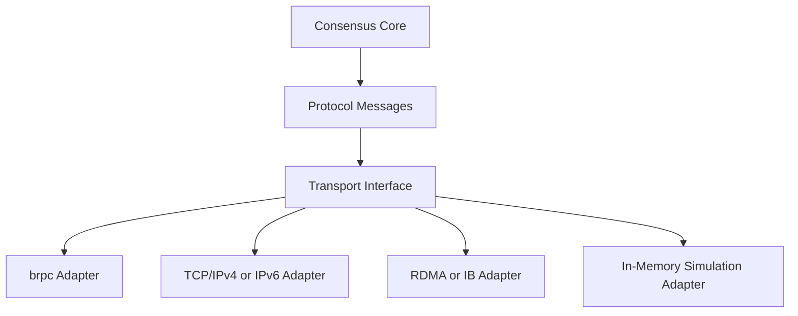

# Transport Layer

Transport is an adapter in QuorumKit, not the center of the design.

That sounds like a small wording choice, but it has big consequences. If the public API starts speaking in brpc objects, IPv4-only endpoint types, or protobuf service inheritance, then transport stops being replaceable in any meaningful sense.

## The Boundary

The core speaks in protocol and identity. Transport adapters decide how those messages are delivered.

## Identity Is Not Addressing

One of the easiest ways to accidentally hard-wire a transport is to make peer identity mean “whatever address format this network stack likes.” QuorumKit keeps those ideas separate.

Logical identity names the peer in the replication group. Transport address says how to reach it in a particular deployment. That leaves room for IPv4, IPv6, host-and-port naming, RDMA or IB-style addresses, in-memory simulation channels, and other transport-specific schemes without rewriting the consensus-facing model.

## What The Adapter Owns

A transport adapter is responsible for the practical machinery: sending and receiving messages, request/response matching, connection reuse, cancellation, serialization hooks, and transport-specific observability. Those are real concerns, but they should not leak into the public API where they would become long-term obligations.

## brpc Still Fits Here

brpc remains a valid adapter. The braft compatibility layer can keep brpc-shaped entry points where needed, because that is part of honoring the old surface. What changes is the architectural meaning: brpc becomes one transport implementation among several possibilities instead of the language the whole library is forced to speak.

## Discovery And Snapshot Transfer

Discovery sits beside transport, not inside it. Finding the current leader and remembering where to send client traffic is a different concern from moving bytes.

The same goes for snapshots. A snapshot is persisted state; snapshot transfer is how that state moves across the network. Keeping those apart makes both pieces easier to replace.
