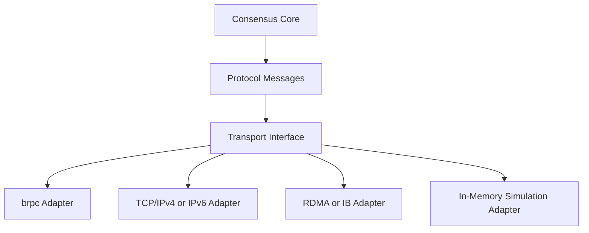

# Transport Layer

QuorumKit treats transport as a replaceable adapter.

## Transport Neutrality

The consensus model does not depend on:

- brpc server registration,
- brpc controller objects,
- protobuf service inheritance,
- IPv4-only endpoint classes,
- socket-oriented address parsing,
- a specific network stack.

The transport layer defines how messages move, not what the replicated state machine means.

## Transport Model

## Identity And Addressing

The canonical QuorumKit model separates logical identity from transport location.

### Logical Identity

Logical identity names a peer or node in the replication group. It is stable across transport changes.

### Transport Address

Transport address describes how to reach that logical identity in a concrete adapter.

The address model supports multiple schemes, including:

- IPv4 TCP endpoints,
- IPv6 TCP endpoints,
- host-and-port naming,
- RDMA-oriented addresses,
- in-memory simulation channels,
- custom deployment-specific address forms.

The public API treats address as transport metadata, not as the core meaning of peer identity.

## Adapter Responsibilities

Concrete transport adapters provide:

- message send and receive,
- request/response correlation,
- server registration,
- connection reuse,
- cancellation,
- serialization integration,
- address parsing and rendering,
- transport-specific metrics and observability.

These concerns are internal adapter responsibilities, not public API obligations.

## brpc Integration

brpc exists as one transport adapter implementation. It does not define the canonical API.

braft compatibility functions may keep brpc-shaped entry points because they preserve the original surface, but the QuorumKit public API remains transport-neutral.

## Discovery And Routing

Leader discovery is distinct from transport.

- discovery resolves or refreshes the current leader for a group,
- transport delivers messages to a chosen address,
- address resolution maps a logical peer to a concrete transport address.

This keeps route-table style logic independent from a specific RPC framework.

## Snapshot Transfer

Snapshot transport is separate from snapshot persistence.

The system distinguishes:

- snapshot data as persisted state,
- snapshot transfer as transport activity,
- snapshot import and export orchestration as internal workflow.

This separation keeps snapshotting modular when transport changes.
