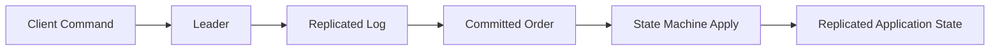

# Mental Model

At its core, QuorumKit is a replicated state machine library.

Clients submit commands. One node leads. The command is replicated, committed in a durable order, and eventually applied to a user-defined state machine. If every replica starts from the same state and applies the same committed sequence, they arrive at the same result.

That is the center of the design. Everything else exists to support it.

## The Two Public Faces

QuorumKit presents two public APIs.

The first is QuorumKit itself: the canonical surface, the one new code should use, and the one the project is trying to make as clear and stable as possible.

The second is the braft compatibility surface. It keeps existing integrations working by translating braft names and calling patterns into the QuorumKit model.

## The Internal Face

Inside the project, there is another layer entirely: the consensus core, runtime adapters, transport adapters, storage adapters, snapshot machinery, serialization, and deterministic test infrastructure. None of that is meant to be part of the installed public contract.

## Why The Boundaries Matter

These boundaries are what make the design flexible.

They let the project change transports without rewriting consensus logic, move between storage backends without redesigning the public API, test the public surface without booting a production environment, and keep the core small enough to think about in a mostly single-threaded way.

The easiest way to summarize the model is this: the ordered command stream is the point of the system, and nearly everything around it is an adapter.
