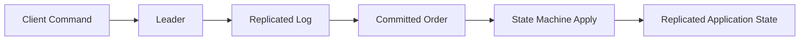

# Mental Model

QuorumKit is a replicated state machine library.

The library accepts commands, replicates them across a group, commits them in a stable order, and drives a user-supplied state machine with that committed sequence.

## Core Model

The essential guarantee is that replicas that begin from the same state and apply the same committed sequence reach the same resulting state.

## Public Faces Of The System

The repository exposes two public faces.

### QuorumKit

QuorumKit is the canonical public model. It uses concept-driven headers and a transport-neutral, storage-neutral architecture.

### braft Compatibility

The braft surface preserves source compatibility for existing integrations. It maps braft names and calling patterns into QuorumKit.

## Internal Face Of The System

The internal face contains:

- the core consensus state machine,
- runtime adapters,
- transport adapters,
- storage adapters,
- snapshot coordination,
- serialization adapters,
- deterministic test infrastructure.

This face is not installed as public API.

## Architectural Center

The conceptual center of the repository is not a particular RPC library, filesystem, database, or build tool. The center is the ordered replicated command stream and the contracts around it.

Everything else is an adapter:

- transport adapts message movement,
- storage adapts persistence,
- runtime adapts execution,
- compatibility adapts the braft API vocabulary,
- build tooling adapts repository consumption.

## Why The Boundaries Matter

These boundaries make it possible to:

- change transport without rewriting consensus logic,
- change storage backend without rewriting public APIs,
- migrate between storage backends without changing the core model,
- test public APIs without production infrastructure,
- simulate failures deterministically,
- reason about the core in a single-threaded model.
