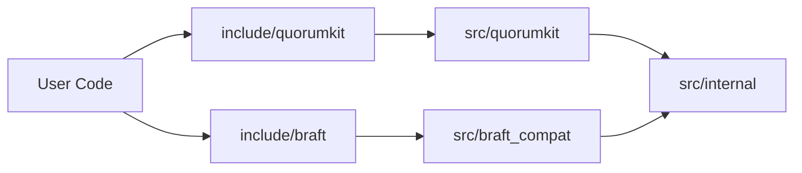

# Public And Internal Boundaries

The repository has a strict distinction between supported interfaces and implementation detail.

## Public Means Installed And Supported

A public header is a header that appears under one of these roots:

- `include/quorumkit`
- `include/braft`

These headers are part of the supported contract.

## Internal Means Free To Refactor

Code under `src/internal` is implementation detail. It exists to make the public contracts work, but it is not an API promise.

This allows the repository to change:

- data structures,
- execution strategies,
- transport adapters,
- storage adapters,
- serialization formats,
- build integration details,

without changing what users include and depend on.

## Compatibility Is Public But Not Canonical

The `braft` surface is a supported public surface. It is public because consumers depend on it. It is not canonical because the repository uses `quorumkit` as its primary vocabulary.

## Boundary Diagram

The arrows point from stable outer surfaces toward replaceable inner implementation.
