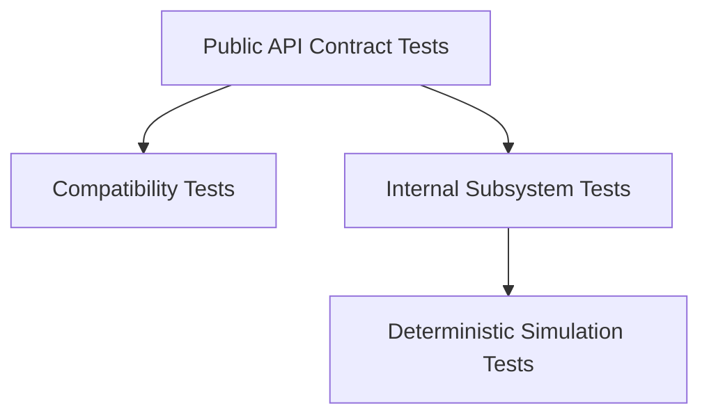

# Design For Testability

Testability is one of the design constraints, not something added afterward.

If a public behavior matters, it should be possible to test it through the public API. That sounds obvious, but it rules out a lot of bad habits: private-member visibility hacks, direct dependence on internal headers, hidden global clocks, hidden random sources, and APIs that only make sense when a full production stack is already running.

## What Needs To Be Injectable

The main seams are time, randomness, scheduling, transport, storage, snapshot hooks, and telemetry sinks. Once those are explicit, deterministic tests become much easier to write and much easier to trust.

## Why Determinism Matters

The core is meant to behave like an ordered state transition system. Deterministic clocks, transports, and storage backends let that behavior be replayed instead of merely observed. That is the foundation for stronger simulation, better fault injection, and eventually the kind of proof-oriented reasoning the project is aiming toward.

The practical payoff is simple: when the system fails in a test, the test should tell you something real instead of just reminding you that timing is hard.
