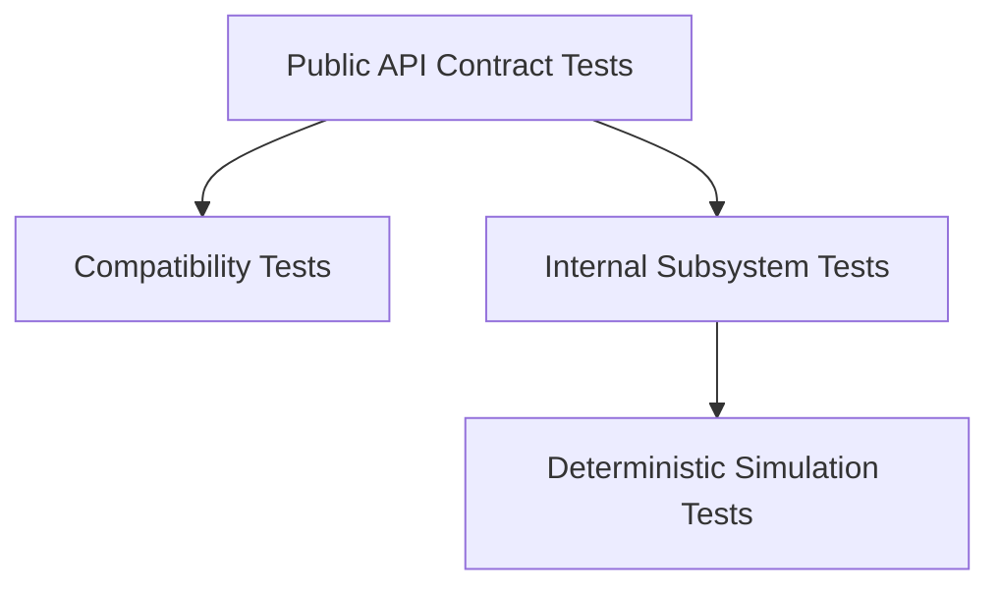

# Design For Testability

Testability is part of the architecture, not a separate cleanup step.

## Testability Rule

Any public behavior should be testable through public interfaces.

That means public API tests do not depend on:

- private-member visibility hacks,
- implementation-only headers,
- global singletons for time or randomness,
- mandatory live RPC infrastructure,
- mandatory production storage backends.

## Key Injection Points

The architecture keeps the following concerns injectable:

- clocks,
- randomness,
- scheduling,
- transport,
- storage,
- snapshot hooks,
- telemetry sinks.

This is what makes deterministic public API tests and deterministic simulation possible.

## Test Layers

Each layer answers a different question.

- public tests verify supported behavior,
- compatibility tests verify braft-compatible behavior,
- internal tests verify subsystem correctness,
- simulation tests verify cluster behavior under fault and concurrency conditions.

## Determinism

The core is modeled as an ordered state transition system. Deterministic clocks, transports, and storage backends make behavior reproducible across runs.

This is the basis for a FoundationDB-style surrounding test framework and for proof-oriented reasoning about the core.
