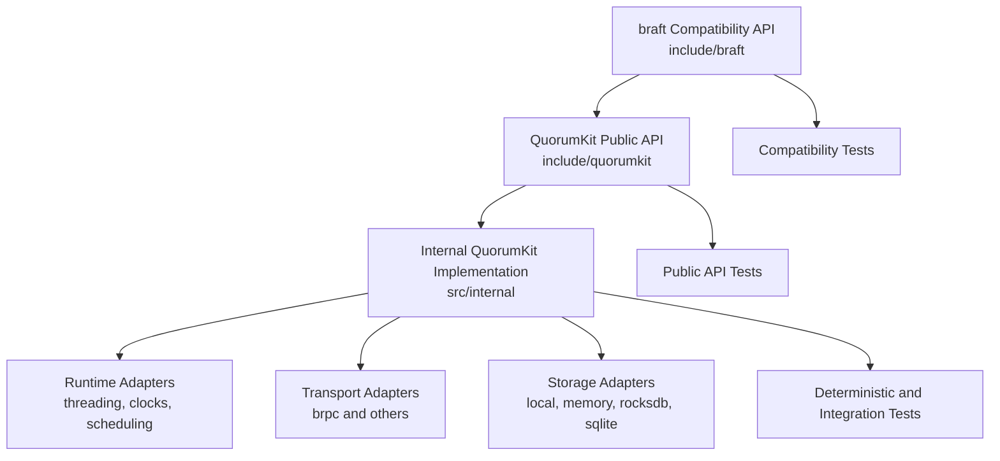

# Architecture overview

QuorumKit has two public APIs and one implementation beneath them.

- `quorumkit` is the API the project is built around.
- `braft` remains as a compatibility layer.
- `internal` is where the engine, adapters, and test infrastructure live.

The important part is not the count. It is the boundary. Public code is easy to spot. Compatibility is explicit. Internal code has room to change without turning every refactor into a migration project for users.

## The shape of the system

The public surface stays small. The implementation grows inward, not outward.

## What this architecture optimizes for

New code should read like QuorumKit, not like a fork that never decided what it wanted to be. The compatibility layer should stay a bridge, not become a second center of gravity. The core should stay small enough to reason about, while the surrounding system stays modular enough to swap transports, storage engines, runtimes, and packaging without rewriting everything.

Testing follows the same line of thought. Public behavior should be easy to test directly. The core should run under deterministic clocks, transports, and storage fakes. The system should be open to simulation, not just end-to-end smoke tests.

## Read the rest of the explanation section

- [Repository layout](/docs/explanation/repository-layout)
- [Canonical public API](/docs/explanation/canonical-public-api)
- [braft compatibility surface](/docs/explanation/braft-compatibility-surface)
- [Internal architecture](/docs/explanation/internal-architecture)
- [Runtime and execution model](/docs/explanation/runtime-and-execution-model)
- [Transport layer](/docs/explanation/transport-layer)
- [Storage layer](/docs/explanation/storage-layer)
- [Testing architecture](/docs/explanation/testing-architecture)
- [Build and packaging modularity](/docs/explanation/build-and-packaging-modularity)
- [Protocols and features](/docs/explanation/protocols-and-features)
- [Compatibility and migration](/docs/explanation/compatibility-and-migration)
