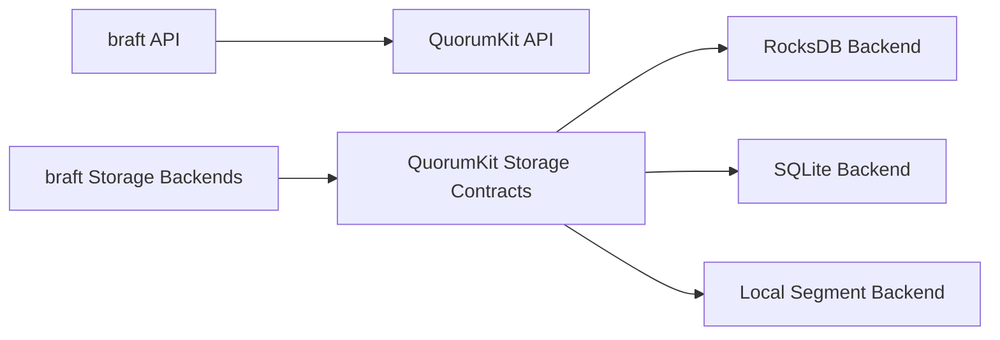

# Compatibility and migration

Compatibility is only useful if it gives people a path forward.

In QuorumKit, that path runs along two tracks. One is API compatibility through the braft surface. The other is storage compatibility through support for existing braft storage backends and migration into newer backend arrangements.

