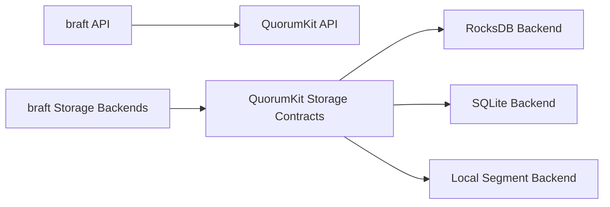

# Compatibility and migration

Compatibility only matters if it gives people a path forward.

In QuorumKit, that path has two parts. One is API compatibility through the braft surface. The other is storage compatibility through the existing braft storage backends and a migration path toward newer backend arrangements.

