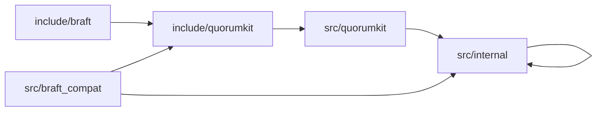

# Repository Layout

The repository is laid out so that a reader can tell, almost at a glance, what is public and what is not.

That is more important than it sounds. One of the easiest ways a systems library becomes hard to evolve is by letting implementation headers masquerade as APIs. QuorumKit tries to make the boundary visible in the tree itself.

## The Shape Of The Tree

```text
include/
  quorumkit/
  braft/

src/
  quorumkit/
  braft_compat/
  internal/

test/
  public/
    quorumkit/
    braft_compat/
  internal/
  simulation/

examples/
  quorumkit/
  braft_compat/

tools/
  quorumkit/
  braft/

cmake/
bazel/
packaging/
docs/
```

## The Important Boundaries

`include/quorumkit` is the public API the project is built around. These headers are installed, documented, and tested as contract.

`include/braft` is public too, but for a different reason: it preserves compatibility for existing users. It is a supported bridge, not the place where the system should keep growing new ideas.

`src/quorumkit` holds the code that implements the public QuorumKit layer. `src/braft_compat` is where the compatibility bridge lives. `src/internal` is everything behind that public wall: the engine, adapters, and helpers that users should not need to include directly.

## Dependency Direction



The arrows only go inward. Internal code does not depend on the compatibility headers. The compatibility layer does not define the model. The QuorumKit surface does not leak internal implementation types.
