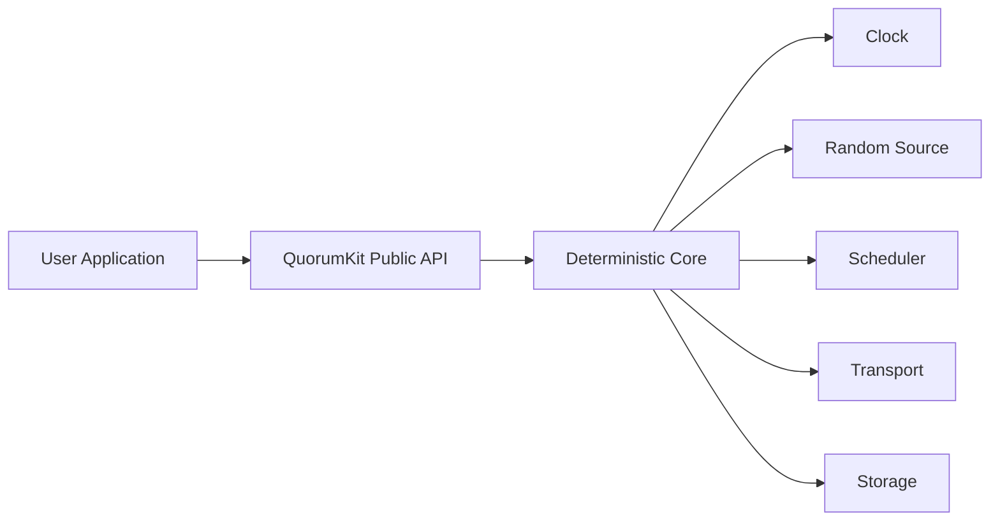

# Runtime and execution model

QuorumKit treats the core as a state machine. The runtime is everything around it that makes it useful in a real program.

The core should not decide what time it is, how work is scheduled, how packets move, or how bytes reach disk. It asks for those services through interfaces.
