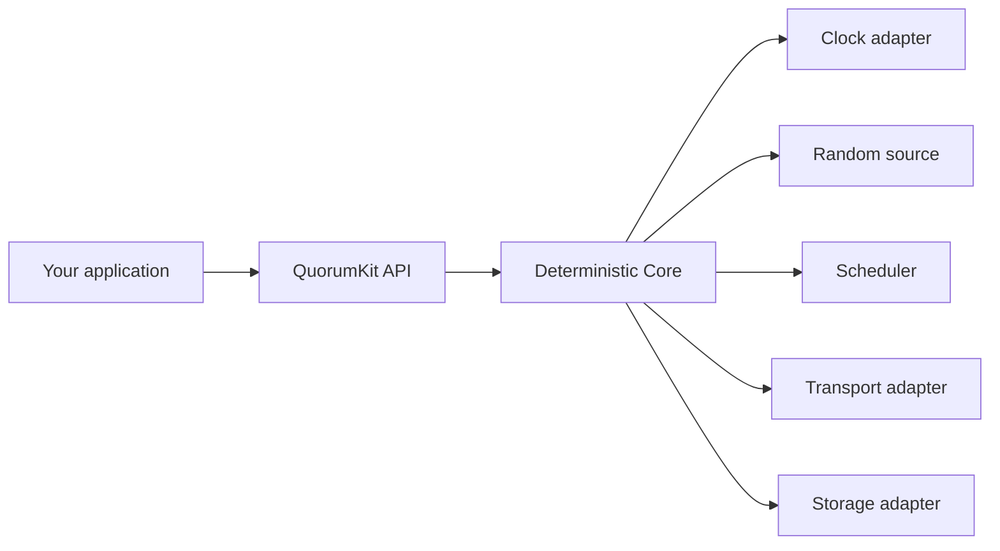

# Runtime and execution model

The Raft core in QuorumKit is a state machine. It takes inputs (messages from peers, timer expirations, client requests) and produces outputs (messages to send, log entries to write, state transitions to apply). It does not own a thread, read a clock, or generate random numbers by itself.

Everything the core needs from the outside world comes through adapter interfaces:

In production, the runtime adapters supply real wall clocks, OS threads, and actual randomness. In tests, they are replaced with deterministic fakes: a simulated clock that advances only when the test says so, a seeded random source, and an in-memory transport that lets you control exactly when messages arrive or get dropped.

This split is what makes deterministic simulation testing possible. The core runs the same code in production and under test -- the only difference is which adapters are wired in. You can replay the same sequence of events and get the same result every time, which is exactly what you need when debugging a subtle Raft edge case.
