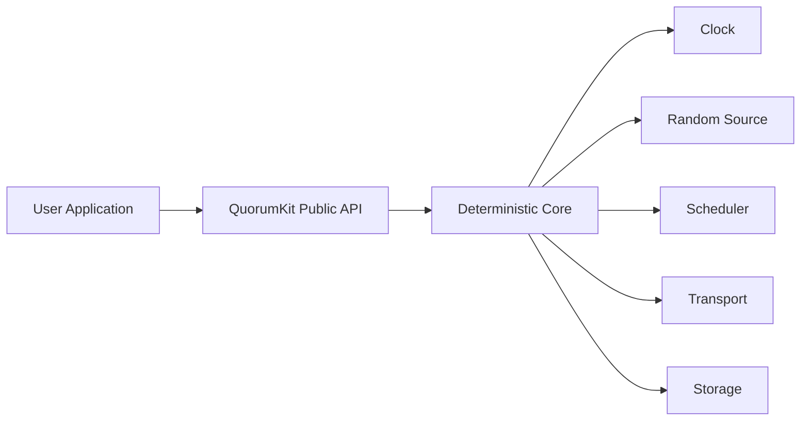

# Runtime and execution model

QuorumKit treats the core of the system as a state machine and the runtime as everything needed to let that state machine live in the world.

The core should not decide what time it is, how work gets scheduled, how packets move, or how bytes reach disk. It asks for those services through interfaces.
