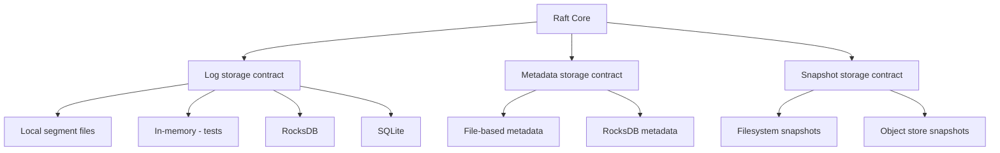

# Storage layer

The Raft core needs three kinds of persistent state: the log (the ordered sequence of entries), metadata (current term, voted-for), and snapshots (compressed checkpoints of the state machine).

Each of these has a contract interface in the library. The actual persistence is handled by pluggable backends.

## Existing backends

QuorumKit still supports the braft storage backends: local segment-file logs and filesystem-based snapshots. These are the backends most existing deployments use, and they continue to work through the compatibility layer. If you are migrating from braft, you do not need to change your storage to get started.

## Adding backends

The storage contracts are defined in `src/internal/storage/`. A new backend implements the contract interface -- write log entries, read log entries, persist metadata, save and load snapshots -- and plugs in through configuration. The core does not know or care which backend is active.

The in-memory backends exist specifically for tests. They are fast, deterministic, and do not touch the filesystem, which makes them suitable for simulation testing alongside the in-memory transport and deterministic clock.

## Migrating between backends

Changing storage backends on a running cluster is a real operation, not just a configuration change. You need to think about data migration, validation, and rollback. The library supports running the old and new backends at the same time during a transition period, but the migration itself is your responsibility to plan and execute carefully.
