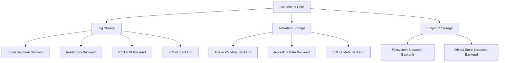

# Storage layer

Storage is one of the places where QuorumKit has to balance cleanup with compatibility.

The goal is a clean storage model: backend-neutral contracts, swappable implementations, deterministic fakes for tests, and enough separation from the core that changing persistence does not mean rewriting consensus logic. At the same time, the existing braft storage backends still matter, and migration between backends matters too.

