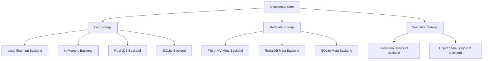

# Storage Layer

Storage is one of the places where QuorumKit has to be both ambitious and practical.

The library wants a clean storage model: backend-neutral contracts, swappable implementations, deterministic fakes for tests, and enough separation from the core that changing persistence does not mean rewriting consensus logic. At the same time, it has to respect the world it comes from. Existing braft storage backends matter, and migration between backends matters just as much.

