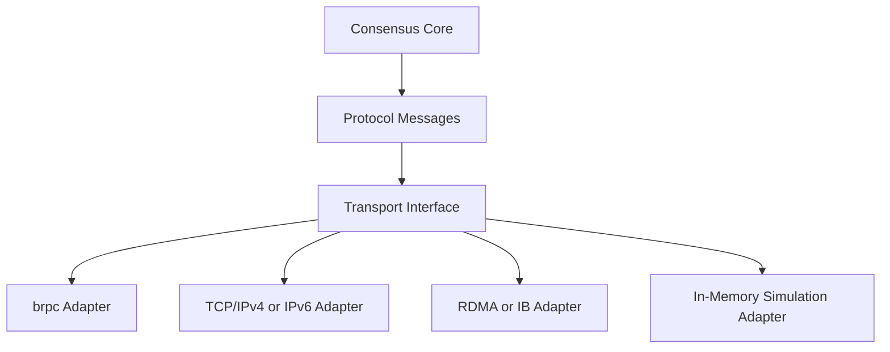

# Transport Layer

Transport is an adapter in QuorumKit, not the center of the design.

```mermaid
flowchart TD
    Core[Consensus Core] --> Msg[Protocol Messages]
    Msg --> Transport[Transport Interface]
    Transport --> Brpc[brpc Adapter]
    Transport --> Tcp[TCP/IPv4 or IPv6 Adapter]
    Transport --> Rdma[RDMA or IB Adapter]
    Transport --> Sim[In-Memory Simulation Adapter]
```

The core speaks in protocol and identity. Transport adapters decide how those messages are delivered.
