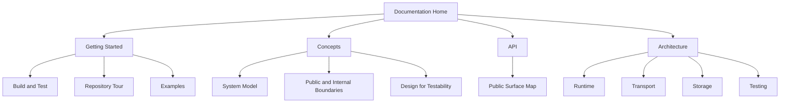

# QuorumKit Documentation

This documentation tree is the primary reference for the QuorumKit repository, its public APIs, its compatibility surface, and its internal architecture.

QuorumKit has three distinct faces:

- a canonical `quorumkit` public API,
- a supported `braft` compatibility API,
- an internal implementation surface that contains the core, adapters, and testing infrastructure.

QuorumKit preserves storage continuity across the compatibility boundary. It works with the existing braft storage model and treats migration between storage backends as part of the storage architecture rather than as an external one-off conversion problem.

## Reading Guide

If you are new to the repository, read the docs in this order:

1. [Quick Start](./getting-started/quick-start)
2. [Repository Tour](./getting-started/repository-tour)
3. [Mental Model](./concepts/mental-model)
4. [Public API Overview](./api/overview)
5. [Architecture Overview](./architecture)

## Documentation Map

## Sections

- `docs/getting-started/` explains how to build the repository, navigate the tree, and run examples.
- `docs/concepts/` defines the vocabulary of the system.
- `docs/api/` describes the public surfaces and how headers are organized.
- `docs/architecture/` describes the internal architecture in detail.

## Documentation Standard

The docs and the public headers are aligned.

The intended reading experience is:

- read the docs to understand the large-scale structure,
- read the public headers to understand exact contracts,
- read the examples to see application hosting patterns,
- read internal code only when implementation detail matters.

This tree is organized around the actual boundaries of the repository: canonical API, compatibility API, internal implementation, and testing.
