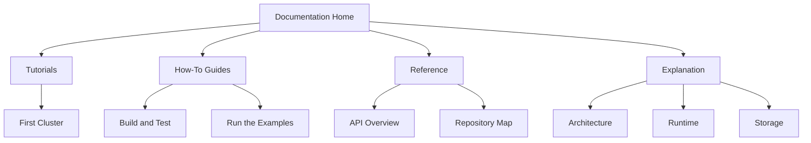

# QuorumKit Documentation

QuorumKit is a Raft library. The docs are organized around the shape of the project: the QuorumKit API, the braft compatibility layer, and the internals that sit underneath both.

These docs now follow Diataxis.

- Tutorials help you learn by doing.
- How-to guides help you complete a task.
- Reference gives you the factual material.
- Explanation tells you why the system looks the way it does.

## Start here

If you are new to the project, this is a good reading order:

1. [Build your first cluster](./tutorials/first-cluster)
2. [Check prerequisites](./how-to/prerequisites)
3. [Build and test QuorumKit](./how-to/build-and-test)
4. [Public API overview](./reference/api-overview)
5. [Architecture overview](./architecture)

## The four modes

### Tutorials

Tutorials are for learning by doing.

### How-to guides

How-to guides are for specific tasks: build the repo, run the docs, navigate the code, run the examples.

### Reference

Reference is the factual part: API surfaces, repo map, examples, and build details.

### Explanation

Explanation covers the design: architecture, compatibility, runtime, transport, storage, testing, and migration.
