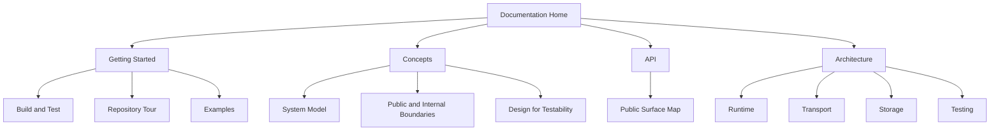

# QuorumKit Documentation

QuorumKit is a Raft library, but the interesting part is not just that it replicates a log. The interesting part is how the repository is being shaped: a clean QuorumKit API, a sharply bounded braft compatibility layer, a small core that can be reasoned about precisely, and a testing story built around deterministic simulation instead of hope.

If you are new here, start with the basics and work inward.

1. [Quick Start](./getting-started/quick-start)
2. [Repository Tour](./getting-started/repository-tour)
3. [Mental Model](./concepts/mental-model)
4. [Public API Overview](./api/overview)
5. [Architecture Overview](./architecture)

## What You Will Find Here

The docs are organized around the same boundaries as the code.

- `docs/getting-started/` helps you build the repo, find your way around, and run examples.
- `docs/concepts/` defines the vocabulary: what a node is, what the public boundary is, and why testability matters.
- `docs/api/` explains the two supported public surfaces: QuorumKit and braft compatibility.
- `docs/architecture/` goes deep on runtime, transport, storage, testing, packaging, and the internal shape of the system.

## How To Read These Docs

These pages are not meant to replace the headers. They are meant to make the headers easier to read.

The usual path is:

- read the docs to understand the shape of the system,
- read the public headers to understand the exact contracts,
- read the examples to see how those contracts look in a real application,
- read internal code only when you care about implementation details.

That is the standard the docs are written to. They should feel like a careful engineering guide, not a pile of scattered notes.
