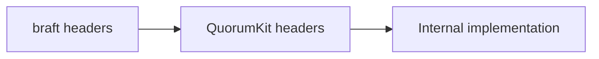

# Public API overview

QuorumKit has two sets of public headers. Both are installed with the library.

## `include/quorumkit/`

The primary API. New code should use these headers.

```text
include/quorumkit/
  types.h          shared types: peer IDs, group IDs, error codes
  node.h           creating and operating a Raft node
  admin.h          administrative operations: add/remove peer, transfer leader
  discovery.h      peer discovery and route table
  storage.h        storage backend contracts
  util.h           small utilities
  extensions/
    filesystem.h   filesystem snapshot adaptor
    throttle.h     snapshot throttle
```

`node.h` is where most users start. It defines the node lifecycle: create, start, apply, snapshot, shut down. The other headers support it.

## `include/braft/`

The compatibility API. Existing braft code can keep using these headers -- they forward into the QuorumKit implementation underneath.

```text
include/braft/
  raft.h                 node and state machine types
  configuration.h        peer configuration
  cli.h                  admin CLI helpers
  route_table.h          route table / discovery
  storage.h              storage interfaces
  util.h                 utilities
  file_system_adaptor.h  filesystem adaptor
  snapshot_throttle.h    snapshot throttle
  protobuf_file.h        protobuf file helpers
```

## How the two relate



The braft headers depend on the QuorumKit headers, not the other way around. QuorumKit defines the model; the braft layer adapts to it.

For more on the design behind each surface, see [Canonical public API](../explanation/canonical-public-api) and [braft compatibility surface](../explanation/braft-compatibility-surface).
