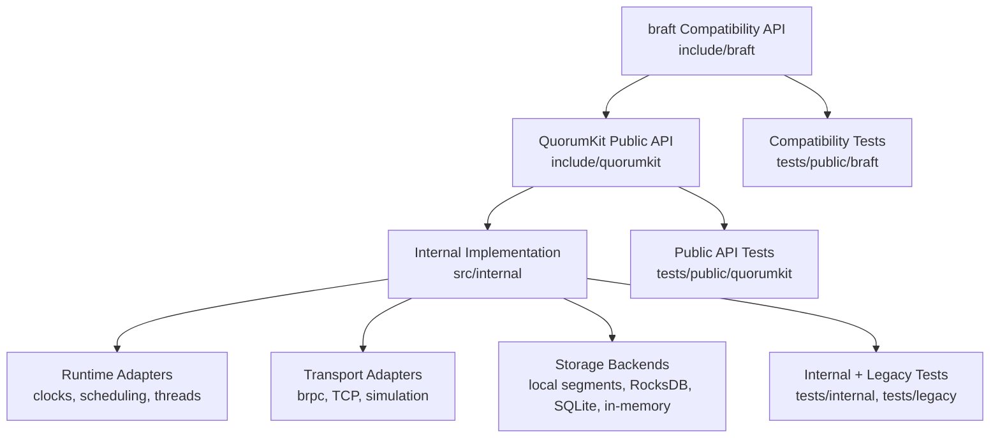

# Architecture overview

QuorumKit has two public APIs and a shared implementation underneath.

`include/quorumkit/` is the primary API. `include/braft/` is a compatibility layer that preserves the old braft names and calling conventions. Both sets of headers are installed with the library, and both call into the same internal code under `src/internal/`.

The braft headers depend on the QuorumKit headers, never the other way around. Internal code depends on nothing public. This means the internals can change freely -- splitting modules, swapping implementations, reorganizing files -- without breaking either public surface.

## What sits inside the core

The Raft state machine itself lives in `src/internal/core/`. It handles elections, log replication, commitment, and application order. It does not open sockets, read clocks, or write to disk directly. Instead, it talks to adapter interfaces for all of those things, which makes the core testable under simulated time, simulated networks, and simulated storage.

The adapters -- runtime, transport, and storage -- live alongside the core in `src/internal/`. Each one is replaceable. The current production transport uses brpc, but the interface is written so you could plug in raw TCP, RDMA, or an in-memory loopback for tests. The same goes for storage: the existing braft backends (local segments, RocksDB) still work, and the interface supports adding new ones.

## Where to read more

- [Repository layout](./repository-layout) -- why the directory tree looks the way it does
- [Canonical public API](./canonical-public-api) -- what the QuorumKit headers cover
- [braft compatibility surface](./braft-compatibility-surface) -- what the compatibility layer preserves
- [Internal architecture](./internal-architecture) -- what lives inside `src/internal/`
- [Runtime and execution model](./runtime-and-execution-model) -- how the core relates to clocks and threads
- [Transport layer](./transport-layer) -- how messages move between nodes
- [Storage layer](./storage-layer) -- how logs, metadata, and snapshots are persisted
- [Testing architecture](./testing-architecture) -- how the test tree is organized
- [Build and packaging modularity](./build-and-packaging-modularity) -- how build tooling stays modular
- [Protocols and features](./protocols-and-features) -- core Raft vs. surrounding features
- [Compatibility and migration](./compatibility-and-migration) -- the migration path from braft
