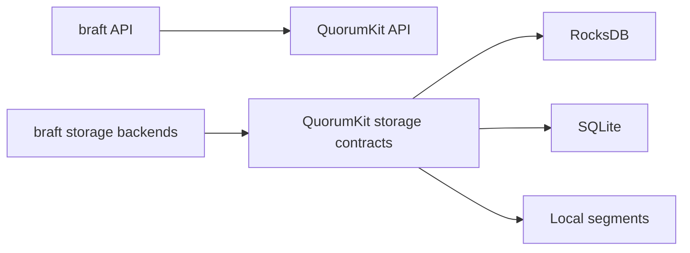

# Compatibility and migration

QuorumKit needs to keep existing braft deployments working while moving the API and internals forward. That means two kinds of compatibility: API compatibility and storage compatibility.

## API compatibility

The headers under `include/braft/` preserve the old braft API for the parts of braft that real applications commonly build against: nodes, state machines, tasks, snapshots, peer reconfiguration, leadership transfer, and the usual mockable interfaces around them. The braft headers are thin adapters that forward into the QuorumKit implementation -- there is no separate braft engine.

The goal is to let you migrate at your own pace. Existing code runs through the compatibility layer. New code targets the QuorumKit headers. Over time, you move the old code over. Nothing forces you to do it all at once.

This is now documented as a real contract rather than a general promise. If your code stays inside the surface listed in [braft compatibility contract](../reference/braft-compatibility-contract), QuorumKit intends that code to remain a drop-in source-level match.

## Storage compatibility

This is the harder part. If you have a running cluster with Raft logs and snapshots on disk, those files were written by a specific storage backend family. QuorumKit still supports the existing braft backends, so existing data keeps working. But if you want to switch to a different backend family, you need a migration path that is precise, repeatable, and testable.

QuorumKit therefore treats migration as part of the storage contract itself. Every storage backend family must support:

- bootstrap from any other backend family
- dual write with any other backend family

QuorumKit standardizes this through a canonical bootstrap representation so that new backends do not require a custom converter for every existing backend. For the precise rules, see [Storage backend contract](../reference/storage-backend-contract).

For the practical steps, see [Migrate from braft](../how-to/migrate-from-braft).
