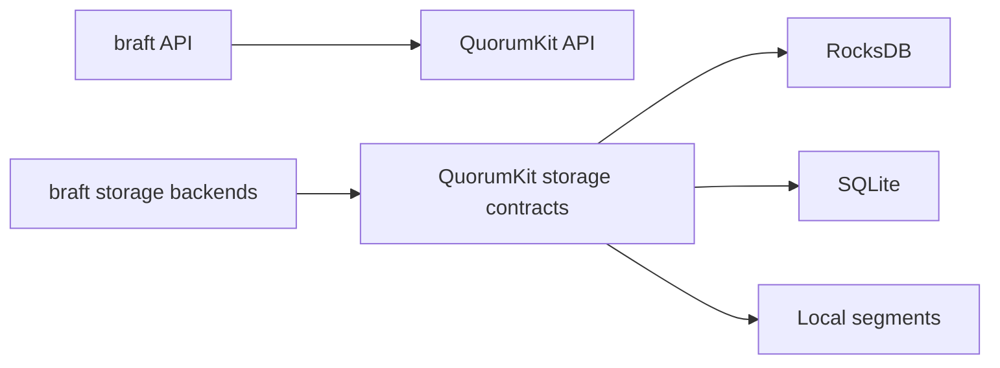

# Compatibility and migration

QuorumKit needs to keep existing braft deployments working while moving the API and internals forward. That means two kinds of compatibility: API compatibility and storage compatibility.

## API compatibility

The headers under `include/braft/` preserve the old braft API for the parts of braft that real applications commonly build against: nodes, state machines, tasks, snapshots, peer reconfiguration, leadership transfer, and the usual mockable interfaces around them. The braft headers are thin adapters that forward into the QuorumKit implementation -- there is no separate braft engine.

The goal is to let you migrate at your own pace. Existing code runs through the compatibility layer. New code targets the QuorumKit headers. Over time, you move the old code over. Nothing forces you to do it all at once.

This is now documented as a real contract rather than a general promise. If your code stays inside the surface listed in [braft compatibility contract](../reference/braft-compatibility-contract), QuorumKit intends that code to remain a drop-in source-level match.

## Storage compatibility

This is the harder part. If you have a running cluster with Raft logs and snapshots on disk, those files were written by the braft storage backends. QuorumKit still supports those backends, so existing data keeps working. But if you want to switch to a different storage backend (say, from local segment files to RocksDB), you need to migrate the data.

Storage migration is a real operational task. It involves running old and new backends in parallel during a transition, validating that the new backend produces the same results, and having a rollback plan. The library provides the storage contracts and backend implementations, but the migration planning is yours.

For the practical steps, see [Migrate from braft](../how-to/migrate-from-braft).
