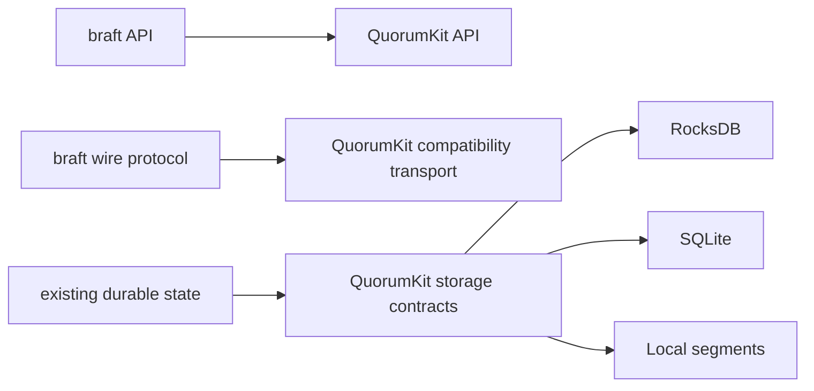

# Compatibility and migration

QuorumKit needs to keep existing deployments working while moving the API and internals forward. That means three kinds of compatibility have to hold at once:

- API compatibility, so existing application code keeps compiling
- wire compatibility, so old nodes and new nodes can share a live cluster
- storage compatibility, so durable state keeps working and can move between backend families

## API compatibility

The headers under `include/braft/` preserve the old braft API for the parts of braft that real applications commonly build against: nodes, state machines, tasks, snapshots, peer reconfiguration, leadership transfer, and the usual mockable interfaces around them. The braft headers are thin adapters that forward into the QuorumKit implementation -- there is no separate braft engine.

The goal is to let you migrate at your own pace. Existing code runs through the compatibility layer. New code targets the QuorumKit headers. Over time, you move the old code over. Nothing forces you to do it all at once.

This is now documented as a real contract rather than a general promise. If your code stays inside the surface listed in [braft compatibility contract](../reference/braft-compatibility-contract), QuorumKit intends that code to remain a drop-in source-level match.

That contract is intentionally practical. It does not stop at class names and method signatures. It also covers legacy details real applications depend on, such as `local://` storage URIs, the snapshot directory tree made visible through `SnapshotReader::get_path()`, and the usual mock-oriented snapshot/configuration helpers used in conventional test suites.

## Wire compatibility

This is what makes rolling migration possible instead of requiring a flag day. During a mixed-version rollout, old nodes and new nodes still have to elect leaders, replicate logs, install snapshots, and process admin operations together.

That is why QuorumKit treats the legacy braft wire dialect as a separate contract. The transport implementation may evolve internally, but the compatibility path keeps speaking the legacy protocol until an explicit separate protocol migration exists. See [wire compatibility contract](../reference/wire-compatibility-contract).

## Storage compatibility

This is the harder part. If you have a running cluster with Raft logs and snapshots on disk, those files were written by a specific storage backend family. QuorumKit still supports the existing braft backends, so existing data keeps working. But if you want to switch to a different backend family, you need a migration path that is precise, repeatable, and testable.

QuorumKit therefore treats migration as part of the storage contract itself. Every storage backend family must support:

- bootstrap from any other backend family
- dual write with any other backend family

QuorumKit standardizes this through a canonical bootstrap representation so that new backends do not require a custom converter for every existing backend. For the precise rules, see [Storage backend contract](../reference/storage-backend-contract).

For existing deployments, this includes the legacy local braft storage family reached through `local://` URIs. Keeping those URI-level configurations valid is part of the compatibility story, not a special case outside it.

## Why these contracts stay separate

Separating the contracts keeps the design honest.

- An application can satisfy the API contract and still fail migration if it breaks the wire contract.
- A node can satisfy the wire contract and still fail migration if its durable state cannot bootstrap or dual-write into another backend family.
- A backend family can satisfy the storage contract and still not help an old application if the `braft` surface changed underneath it.

Putting each promise in its own reference page makes it possible to test them independently and then combine them under one [rolling migration contract](../reference/rolling-migration-contract).

For the practical steps, see [Migrate from braft](../how-to/migrate-from-braft).
