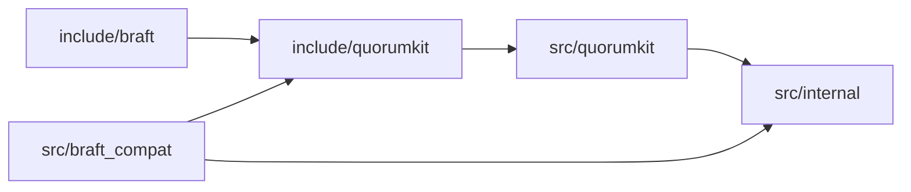

# Repository layout

The directory tree is organized so you can tell at a glance whether something is a public contract or an internal detail.

## Current layout

The repository is in transition from the upstream braft structure to the target QuorumKit layout. Today:

```text
src/
  braft/              library source, headers, and proto files

tests/
  public/             public-facing contract tests
  internal/           implementation-facing tests
  legacy/             inherited upstream-style regression tests
  support/            shared test helpers and shims

examples/
  counter/            replicated counter
  atomic/             compare-and-swap register
  block/              block storage service

contrib/
  brpc/               local Conan recipe (brpc is not on Conan Center)

conanfile.py          Conan 2 project recipe
CMakeLists.txt        top-level build
```

Public headers still live alongside implementation in `src/braft/`. There is no separate `include/` directory yet.

## Target layout

The end state separates public contracts from internal details:

```text
include/
  quorumkit/        canonical public API
  braft/            compatibility API

src/
  quorumkit/        implements the QuorumKit headers
  braft_compat/     implements the braft headers (calls into QuorumKit)
  internal/         everything else: core, runtime, transport, storage

tests/
  public/
    quorumkit/      tests against the QuorumKit API
    braft/          tests against the braft API contract
    wire/           tests for mixed-version wire behavior
    storage/        tests for backend/bootstrap/storage guarantees
    migration/      tests for end-to-end rollout invariants
  internal/         tests for internal modules
  legacy/           inherited regression tests that do not define the public spec
```

## Why this split matters

When implementation headers get mixed in with public ones, every internal refactor risks breaking users. The target layout makes it hard to do that by accident: if a header is in `include/quorumkit/`, it is a public contract; if it is in `src/internal/`, it is free to change.

The braft compatibility headers get their own directory under `include/braft/` rather than being mixed into the QuorumKit tree. That keeps the two surfaces distinct -- you can see exactly which headers exist for compatibility and which ones are the main API.

## Dependency direction



Dependencies point inward. The braft headers depend on the QuorumKit headers. The QuorumKit implementation depends on the internals. Internal code never depends on anything public. This means you can restructure `src/internal/` without touching either public surface.
