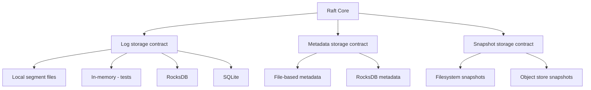

# Storage layer

The Raft core needs three kinds of persistent state: the log (the ordered sequence of entries), metadata (current term, voted-for), and snapshots (compressed checkpoints of the state machine).

Each of these has a contract interface in the library. The actual persistence is handled by pluggable backends.

## Existing backends

QuorumKit still supports the braft storage backends: local segment-file logs and filesystem-based snapshots. These are the backends most existing deployments use, and they continue to work through the compatibility layer. If you are migrating from braft, you do not need to change your storage to get started.

That includes the legacy `local://` URI family used in `NodeOptions.log_uri`, `raft_meta_uri`, and `snapshot_uri`. QuorumKit treats that URI-level configuration shape as part of compatibility, not just an incidental implementation detail.

## Adding backends

The storage contracts are defined in `src/internal/storage/`. A new backend implements the contract interface -- write log entries, read log entries, persist metadata, save and load snapshots -- and plugs in through configuration. The core does not know or care which backend is active.

But in QuorumKit, "implements the storage interface" is not enough. A backend family is only considered complete if it can participate in migration. Every backend family must support dual write and bootstrap from any other backend family. That contract is written down in [Storage backend contract](../reference/storage-backend-contract).

The crucial design choice is that bootstrap is backend-neutral. Each backend family exports and imports a [canonical bootstrap image](../reference/canonical-bootstrap-image) instead of growing a custom converter for every other backend family. That keeps migration design linear as new backends are added.

The in-memory backends exist specifically for tests. They are fast, deterministic, and do not touch the filesystem, which makes them suitable for simulation testing alongside the in-memory transport and deterministic clock.

## Migrating between backends

Changing storage backends on a running cluster is a real operation, not just a configuration change. QuorumKit treats migration as a first-class storage requirement, not an afterthought.

The intended migration path is:

1. export durable Raft state from backend family `A`
2. bootstrap backend family `B`
3. run `A` and `B` in dual-write mode
4. validate equivalence
5. cut over to `B`

The validation step is not a vague operational check. QuorumKit defines [state equivalence and validation](../reference/state-equivalence-and-validation) as part of the migration design so cutover and rollback decisions can later become tests instead of folklore.

For snapshot-backed services, that equivalence includes the public snapshot file tree itself: the relative paths and contents made visible under `SnapshotReader::get_path()` are part of the state the contracts preserve.
