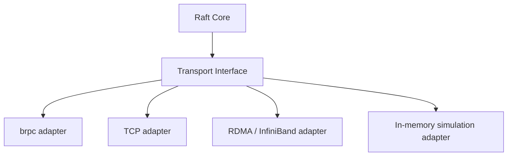

# Transport layer

The Raft core never opens a socket. It produces protocol messages (RequestVote, AppendEntries, InstallSnapshot) and hands them to a transport adapter, which decides how they actually get delivered.

The current production transport is brpc. It handles serialization, connection management, and multiplexing. But because the core talks to an interface rather than to brpc directly, you can swap in a different transport without touching consensus code.

That does not mean the wire protocol is free to change during migration. For a mixed-version rollout, QuorumKit still has to speak the legacy braft wire dialect so old nodes and new nodes can share a cluster. In other words, transport modularity and wire compatibility are different concerns. The implementation may change; the compatibility wire contract stays put. See [wire compatibility contract](../reference/wire-compatibility-contract).

The in-memory simulation adapter is especially useful for tests. It lets you deliver messages instantly, delay them, reorder them, or drop them -- all under program control. Combined with the deterministic runtime, this means you can write tests that exercise specific failure scenarios (network partitions, message reordering, asymmetric connectivity) reproducibly.

Future transports -- raw TCP with IPv6, RDMA, or something entirely different -- plug into the same interface. The core does not care how bytes move; it only cares that messages arrive or do not arrive.

QuorumKit may eventually grow a native wire protocol of its own. If that happens, it should be treated as a separate explicit mode, not as a silent change to the rolling-migration path.
